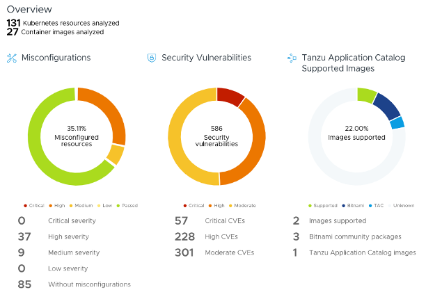

# Enhancing Bitnami Helm Charts Security: A Kubescape Case Study

## Introduction

CVEs get all the press when it comes to secure software supply chain, and for good reason: vulnerabilities in open source code cost the global economy billions of dollars per year. However, even the most secure applications with the best supply chain provenance can be accidentally misconfigured in such a way that leaves insidious security holes lurking in your environment.

Much of the value that [Bitnami](https://bitnami.com/) adds in packaging open source software is in the configuration. Our Helm charts, for example, are loved because they are very thorough in exposing the “knobs and dials'' that are unique to each open source application you deploy to Kubernetes. Developers and IT admins alike also appreciate that we are constantly checking and improving the default configuration we ship in our charts to ensure they are as secure as possible. That’s why, when we recently discovered an open-source Kubernetes security project called [Kubescape](https://github.com/kubescape/kubescape), we saw an opportunity to thoroughly check our software against industry best practices and close any gaps that existed.

<!-- more -->

## Why did we choose Kubescape?

Kubescape is a flexible tool that analyzes Kubernetes software in different ways: it can check Helm charts and artifacts like Dockerfiles in your source code repository, or it can scan the software running in your Kubernetes clusters. We decided to try Kubescape because it covers a wide variety of best practices. Its controls can be tailored to meet specific requirements, ensuring a fine-tuned approach to security. The tool identifies misconfigurations by comparing OSS configurations to industry recognized security best practices from organizations such as NSA-CISA and CIS.

When we ran Kubescape against Bitnami and Tanzu Application Catalog Helm charts, it identified meaningful changes we could make to further secure our software. This discovery led us to include Kubescape in our automated build pipelines to programmatically implement preventative, detective, and corrective measures against any security or quality defects that may be introduced into our software.

We now use Kubescape in several ways to improve our overall security posture and deliver a great user experience for our community users and Tanzu Application Catalog customers.

* We continuously implement security improvements based on Kubescape's risk analysis and security compliance scanning.
* We created an [Open Source Health Assessment](https://tanzu.vmware.com/oss-health-assessment) service where users can upload their Kubescape scanning reports and receive actionable insights.
* We integrated Kubescape into the Bitnami catalog through a Kubescape CLI image, enabling users to initiate OSS health assessments locally using a simple Docker run command.

## Bitnami Helm chart security improvements

So what were those meaningful improvements we could make to our catalogs, thanks to Kubescape? Here are a few of the most important:

* **Eliminated group root dependency**: One of the major improvements was enabling containers to function without group root. Previously, Bitnami charts used user 1001 and group root (following OpenShift standards). The new changes made 1001 the default runAsGroup, eliminating the need for group root and improving security.
* **Configured immutable filesystems**: Using immutable filesystems is a mandatory requirement of security checklists such as NSA or MITRE. This configuration helps enforce an immutable infrastructure strategy; the container only needs to write on the mounted volume that persists the state. An immutable root filesystem is also capable of preventing malicious binaries from writing to the host system.
* **Significantly reduced misconfigured resources**: The OSS health assessment report showed that after implementing its suggested improvements, the percentage of misconfigured resources dropped from 54.55% to 17.39%. This indicates a substantially better security posture for Bitnami Helm charts. The improved charts now address common security concerns such as unnecessary privilege escalation rights, root privileges granted to applications, and issues with ingress and egress configurations.
* **Improved compliance with security frameworks**: Kubescape's ability to detect compliance with multiple frameworks (including NSA-CISA, MITRE ATT&CK®, and the CIS Benchmark) helped ensure that Bitnami Helm charts align better with industry-standard security practices.
* **Enhanced OpenShift compatibility**: When implemented, the configuration changes suggested by Kubescape enabled Bitnami Helm charts to function within OpenShift's restricted-v2 Security Context Constraints (SCC), which was not possible before.

These enhancements further aligned Bitnami and [Tanzu Application Catalog Helm charts](https://tanzu.vmware.com/application-catalog) with industry standards and provide users with greater confidence in their deployments.

For organizations looking to assess their own Kubernetes environments, the [VMware Tanzu OSS Health Assessment tool](https://tanzu.vmware.com/oss-health-assessment), which integrates Kubescape, offers comprehensive reports on misconfigurations and security vulnerabilities within OSS dependencies. It also provides insights using your own data about how upgrading from the community Bitnami Application Catalog to the enterprise [Tanzu Application Catalog](https://tanzu.vmware.com/application-catalog) can save you time and effort in improving your security posture.

<figure markdown>
  { width="600" }
  <figcaption>VMware Tanzu OSS Health Assessment</figcaption>
</figure>

## Final considerations

This case study demonstrates how leveraging tools [Kubescape](https://kubescape.io/) can significantly enhance the security of Helm charts and, by extension, the overall security posture of Kubernetes deployments. As the Kubernetes ecosystem continues to evolve, such initiatives will play a crucial role in maintaining the balance between innovation and security in cloud-native environments.
