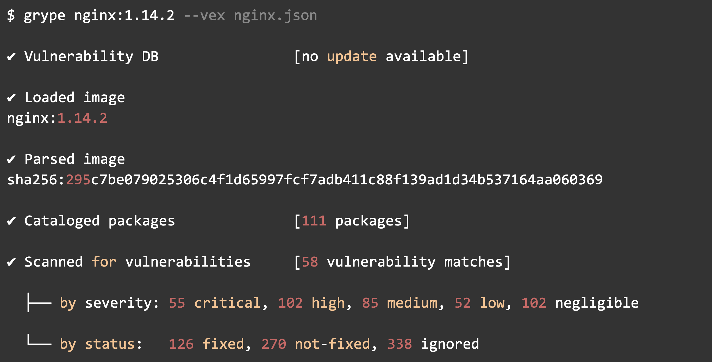

# Kubescape: The 1st Open Source project to support VEX Generation

## Introduction

Vulnerability Exploitability eXchange (VEX) is a vulnerability document designed to complement a Software Bill of Materials (SBOM). It informs users of a software product about the applicability of one or more vulnerability findings.

Security scanners will detect and flag components in software that have been identified as being vulnerable. Often, software is not necessarily affected as signaled by security scanners for many reasons.

For example: 

* The vulnerable component may have been already patched, 

* The vulnerable component may not be present

* The vulnerable code is not actually executed. 

The extreme transparency brought by SBOMs into how software is composed will most likely increase the number of these kinds of false positives, requiring an automated solution to avoid an explosion in the false positive rate of security scans. Hence VEX.

Using VEX is a way to turn down the noise, and give security practitioners a good strong signal, a scanner may consume VEX data from the software supplier. However, it is time-consuming to write a VEX document and since it is imperative these documents stay current, it is a never ending task.
**The solution to this must come via automation.**

!!! note "_[Are you running Kubescape? Want to help us get to incubation in the CNCF? Please help us by filling in our three-question survey!](https://kubescape.io/project/survey/)_"

<!-- more -->

## VEX and vulnerability scanners

The adoption and support of VEX documents represent a major shift in how security practitioners address software vulnerabilities. Primarily, VEX is designed to assist these professionals in determining which vulnerabilities require immediate attention and remediation. This targeted approach is crucial in a landscape where prioritizing security efforts is overwhelming due to the sheer volume of reported vulnerabilities.

Grype and Trivy are two popular open source vulnerability scanners. Their newest versions allow them to ingest VEX documents. Thus, giving clearer results of vulnerability scans, with a better signal-to-noise ratio. Leading to more actionable results, since users of VEX based scans have a good understanding of the vulnerabilities that can hurt them now.

However, one big stumbling block remained - **the sourcing of reliable and accurate VEX documents**.

The ideal providers of VEX documents are the software vendors themselves. They possess the most in-depth understanding of their products and are best positioned to evaluate which vulnerabilities are genuinely exploitable. Despite this, expecting a swift and universal adoption of this practice appears optimistic, particularly in the short term. The creation of VEX documents demands considerable effort from software vendors. While the initial technical evaluation may be something that can be achieved, VEX documents need to be continuously updated to reflect the evolving threat landscape. This requires considerable effort from the software vendors. 

This need poses an even greater challenge for open-source projects, which often operate with limited resources and rely heavily on community contributions. The expectation that these projects will regularly produce detailed VEX documents is probably unrealistic, at least in the near future. Therefore, while the concept of VEX documents is a step in the right direction for cybersecurity, its practical implementation, especially across diverse software ecosystems, remains complex.

## Enter Kubescape

he [Kubescape](http://kubescape.io) project, a Kubernetes security platform, is a CNCF incubating project. It has made significant progress in cybersecurity with its latest feature: the generation of reliable Vulnerability Exploitability eXchange (VEX) documents. Kubescape is the first project to provide this functionality. One of Kubescape's functions is to [scan Kubernetes workload images for vulnerabilities](https://kubescape.io/docs/operator/vulnerabilities/), a task crucial for monitoring the security posture of containerized environments.

A standout feature of Kubescape is its "[Reachability](https://kubescape.io/docs/operator/relevancy/#view-relevancy-information)" capability. This functionality uses eBPF technology to detect which software packages are loaded into memory from a container image during runtime. It then automatically categorizes vulnerabilities associated with unloaded packages as unreachable. This distinction is crucial as it distinguishes between theoretical vulnerabilities and those that pose an actual risk in the given container environment.

Leveraging this reachability feature, Kubescape Operator (version 1.16.2 and up), has started producing VEX documents and storing them as Kubernetes API objects. This approach is a game-changer in vulnerability management. It involves marking reachable vulnerabilities as "affected" and unreachable ones as "not affected," providing clear and actionable signaling for vulnerability prioritization and management.

Using the information it generates, Kubescape can also produce meaningful VEX documents for the images running in a Kubernetes cluster. It flags (logically) vulnerabilities as "affected" based on whether the package that the vulnerability belongs to is loaded into the memory during the runtime of the container. Packages not loaded into memory are left as "not affected" when not loaded to the memory.

The VEX output of Kubescape uses the OpenVEX specification, described below.

These Kubernetes API objects containing VEX information can be easily downloaded and integrated into workflows that use Trivy or Grype (or any other tool that supports OpenVEX). This integration simplifies the vulnerability management process significantly. In many cases, over 80% of the vulnerabilities in an image are marked as "not affected," thus saving practitioners substantial time and effort. 

### Generating VEX Documents with Kubescape

A prerequisite to using Kubescape to generate a VEX document is that you install the Kubescape operator. For details, you can check out [Kubescape documentation](https://kubescape.io/docs/install-operator/) or the [Kubescape GitHub repo](https://github.com/kubescape/operator).

To produce a VEX document, Kubescape needs to see a workload running the given image from its start. In other words, it needs to see containers from start.

Now that all the prerequisites have been fulfilled, the following steps will lead to the auto-generation of a VEX document.

The following example uses a NGINX deployment to demonstrate the generation of a VEX document.

| kubectl apply -f https://k8s.io/examples/application/deployment.yaml |
| -- |

Wait for the VEX objects using this command:

| kubectl -n kubescape get openvulnerabilityexchangecontainers.spdx.softwarecomposition.kubescape.io -w |
| -- |

It takes 2 minutes of monitoring time (by default) to produce the first version of the VEX for the image in the above deployment, it can take more if the processing queue is busy.

To get the VEX document as a JSON file locally you can use jsonpath to extract the .spec field that contains the VEX itself:

| kubectl -n kubescape get openvulnerabilityexchangecontainer $(kubectl -n kubescape get openvulnerabilityexchangecontainer -o jsonpath='{.items[0].metadata.name}') -o jsonpath='{.spec}' > nginx.json |
| -- |

this stores the JSON format in nginx.json

Here is an example to see how many vulnerabilities are affected:

| $ jq "." nginx.json | grep -c "\"affected\""

| 58 |
| -- |

$ jq "." nginx.json | grep -c "\"not_affected\""

| 338 |
| -- |

Now that we have a VEX document in hand, how do we feed it to a scanner?

Let’s take **Grype **as an example scanner:

Grype will take into account the VEX information when calculating results for the image nginx:1.14.2 . Grype will ignore all vulnerabilities that were marked as "not_affected".

Note: the following flow was run and tested on Grype 0.71.0

Here is how to run it:

| grype nginx:1.14.2 --vex nginx.json |
| -- |

This produces the following output (note the 338 ignored vulnerabilities!):

<figure markdown>
  { width="600" }
  <figcaption>VEX output via Grype</figcaption>
</figure>

## VEX formats

While VEX can be applied to any software, it is very effective within Kubernetes environments to communicate the exploitability of vulnerabilities in containerized applications. As such, it is now gaining traction in the open source and cloud-native communities.

There are three main formats for VEX today:

### CycloneDX VEX:

* Integrates seamlessly with the CycloneDX Software Bill of Materials (SBOM) standard.

* Leverages existing SBOM data for product and component identification.

* Provides a dedicated VEX BOM specifically focused on vulnerability exploitability.

* Allows independent VEX documents for dynamic updates without affecting the SBOM.

* Offers tight integration with CycloneDX tools and BOM-Link for deep linking.

* Works well with other SBOM formats like SPDX, but with less tight integration.

### CSAF VEX:

Follows the Common Security Advisory Framework (CSAF) format.

* Focuses on vulnerability information and mitigation guidance.

* Can be combined with SBOM data through references or embedded within a CSAF document.

* Offers wider adoption and familiarity due to CSAF's established presence.

* May require additional data mapping for integration with SBOMs.

### OpenVEX

That being said, the open source community, namely the Linux Foundation, are working on a standard called OpenVEX. OpenVEX is an implementation of VEX that is designed to be minimal, compliant, interoperable, and embeddable. The specification is available in the [OPENVEX-SPEC.md](https://github.com/openvex/spec/blob/main/OPENVEX-SPEC.md) file of the [OpenVEX GitHub repository](https://github.com/openvex). OpenVEX documents are minimal JSON-LD files that capture the minimal requirements for VEX as defined by the VEX working group organized by CISA. The OpenVEX Specification is owned and steered by the community.

## Staying up-to-date

If you’ve reached this point then you probably understand that VEX documents play a critical role in communicating the true risk posed by vulnerabilities within software products. However, the effectiveness of VEX hinges on one crucial factor: regular updates and refreshes.

Here's why keeping VEX documents up-to-date is essential:

**Dynamic Vulnerability Landscape**: Vulnerabilities are constantly evolving. New information about exploitability emerges, patches get released, and attack techniques change. Outdated VEX documents based on old data can lead to:

* Misinformed decision-making: Basing critical security decisions on inaccurate information about exploitability.Misdirected efforts: Wasting time and resources patching vulnerabilities that are no longer exploitable.

* Unpatched critical vulnerabilities: Leaving actual exploitable vulnerabilities unaddressed, increasing security risk.

**Evolving Threat Landscape**: Attackers constantly refine their techniques to exploit vulnerabilities. Keeping VEX documents current ensures you're aware of the latest exploitability information and can prioritize patching accordingly. This minimizes the window of opportunity for attackers and helps you stay ahead of evolving threats.

**Improved Collaboration**: Regular updates keep all stakeholders in the software supply chain on the same page. This facilitates better communication, coordination, and collaboration on vulnerability remediation efforts. Sharing accurate and timely VEX information fosters trust and transparency within the ecosystem.

**Better Risk Management**: Accurate VEX data empowers you to make informed decisions about risk mitigation strategies. You can allocate resources efficiently, prioritize patches based on actual exploitability, and focus on the vulnerabilities that pose the greatest immediate threat. This proactive approach minimizes potential damage and reduces overall security risk.

Refreshing VEX documents regularly can be automated using Kubescape and integrated into existing vulnerability management processes. This ensures a continuous flow of accurate information, enabling proactive risk management and informed decision-making.

Remember, VEX is only as valuable as its data. Keep it fresh, keep it accurate, and stay ahead of the changing vulnerability landscape

##  Conclusion

In this post we introduced the concept of VEX and that some open source scanners can use VEX to give more precise vulnerability scan results. Results that help lighten the load of figuring out which vulnerabilities need to be patch now.

However, to date, VEX adoption is still slow, due to the fact that generating VEX documents, especially those using the OpenVEX standard, is not yet straightforward or automated.

Kubescape is the first open source project that supports auto-generation of VEX documents. These documents can be used in the Kubescape scanner itself, or ingested by other open source scanners, like Grype and Trivy.

So, next time your vulnerability scanner spews an endless list of vulnerabilities whose dependencies you now need to investigate, try Kubescape to lighten the load. 

To follow additional developments in open source Kubernetes security, check out the Kubescape GitHub repo, follow us on X (formerly known as Twitter), or join the community channels (#kubescape, #kubescape-dev) on the CNCF Slack.

## Join the Kubescape community

We welcome your feedback and ideas for improvement. We hold [community meetings](https://kubescape.io/project/community/#monthly-meeting) on Zoom, on the first Tuesday of every month, at 14:00 GMT.

Thanks to all our contributors! Check out our [CONTRIBUTING](https://github.com/kubescape/kubescape/blob/master/CONTRIBUTING.md) file to learn how to join them.

* Feel free to pick a task from the [good first issue list](https://github.com/kubescape/kubescape/issues?q=is%3Aissue+is%3Aopen+label%3A%22open+for+contribution%22) and suggest a design
* [Open an issue](https://github.com/kubescape/kubescape/issues/new/choose): we aim to respond to all issues within 48 hours
* [Join the CNCF Slack](https://slack.cncf.io/) and then our [users](https://cloud-native.slack.com/archives/C04EY3ZF9GE) or [developers](https://cloud-native.slack.com/archives/C04GY6H082K) channel
* Don’t forget to leave a star on our [repository](https://github.com/kubescape/kubescape): it means the world to us!

The Kubescape project follows the [CNCF Code of Conduct](https://github.com/cncf/foundation/blob/master/code-of-conduct.md).
