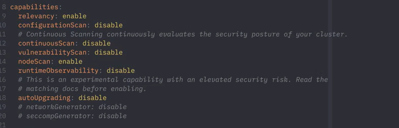

# Kubescape 3.0: The Capabilties System & Continuous Scanning

Kubescape 3.0 is laden with new functionality. In this blog post, we will introduce you to two new and complementary features. 

* The new **Capabilities** system

* The **Continuous Scanning** feature

Watch a short video for a demonstration of these features in action, or read on.

<div class="video-wrapper">
  <iframe width="560" height="315" src="https://www.youtube.com/embed/KkJhEzcLw6k?si=7wLenc1TSm7LaCn2" title="YouTube video player" allow="accelerometer; autoplay; clipboard-write; encrypted-media; gyroscope; picture-in-picture; web-share" allowfullscreen></iframe>
</div>

<!-- more -->

## What’s new and how to?

### The Capabilities System

The Capabilities system allows you to customize Kubescape's functionality according to your needs. You can enable or disable specific features such as Vulnerability and Configuration scanning, Relevancy, and Continuous Scanning. To do so, you just need to edit the values.yaml file and set the corresponding keys to enable or disable.

<figure markdown>
  { width="600" }
  <figcaption>Example of capabilities YAML</figcaption>
</figure>

### Continuous Scanning

One of the features you can enable with the Capabilities system is Continuous Scanning. This enables Kubescape to monitor your cluster's security posture continuously. Whenever a new resource is added to the cluster, Kubescape will automatically trigger a security scan and report the results. This way, you can always have the most up-to-date information about the state of your cluster's security.

To use Continuous Scanning, you need to install Kubescape and set the _continuousScan_ key to _enable_

```yaml

capabilities:

  continuousScan: enable  # Make sure this is set to "enable"

```

Once enabled, the Continuous Scan feature will only scan according to additional capabilities defined by you. In the example below, we have enabled all the capabilities for the continuous scan.

```yaml

capabilities:

  relevancy: enable

  configurationScan: enable

  vulnerabilityScan: enable

  nodeScan: enable

```
After installing Kubescape with Continuous Scanning enabled, you can access the scan results as Custom Resources with the Kubernetes API. You can list all the scan results in your cluster by running the following command:
```
kubectl get workloadconfigurationscans -n default
```
To view a specific scan result in more detail, you can run this, more specific, command:

```
kubectl get workloadconfigurationscans -n default {YOUR_RESOURCE_NAME} -o yaml | less
```
With these commands, you can see how Kubescape evaluates your cluster's security based on the best practices from NSA and MITRE.

# Conclusion

Kubescape 3.0’s new Capabilities system and Continuous Scanning feature are powerful tools that offer customization and continuous monitoring of your cluster’s security posture. By enabling specific capabilities, you can tailor Kubescape to your needs and ensure you always have the most current information about your cluster’s security. 

The ability to access scan results as Custom Resources with the Kubernetes API, will increase your understanding of how Kubescape evaluates your cluster’s security based on the best practices from leading frameworks, such as, NSA-CISA and MITRE ATT&CK. We encourage you to explore these features and share your experiences with us. Stay tuned for more updates and keep your clusters safe and secure with Kubescape.

Please feel free to [raise any issues in the Kubescape GitHub project](https://github.com/kubescape/kubescape/issues) or ask questions [in our Slack channel](https://kubescape.io/project/community/#slack).

Are you enjoying Kubescape? [Please fill in our user survey!](https://kubescape.io/project/survey/)
