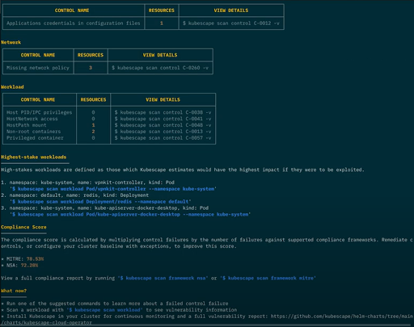

# Kubescape 3.0: CLI improvements

In the latest release of Kubescape, we completely overhauled the CLI experience to make it easier and faster for you to improve the security of your clusters.

Watch the attached video for a complete demonstration of the new CLI and its benefits, or read on.

[Upload [the video](https://drive.google.com/file/d/1WeS5zQ_k6L_seYtHKW6hQaHlekUZA3u6/view?usp=sharing) to Youtube and link here]

## What’s New?

### New overview scan

The new cluster overview/baseline security scan is designed to lessen the shock of being overrun by an overwhelming number of compliance and vulnerability errors identified by Kubescape. It helps you focus on the most important information. 

The results are now structured in a way that presents you with the highest-value information from the get-go: your compliance score against the most popular security frameworks as well as the steps to safely go down the security rabbit hole without getting lost.

The overview scan performs some key security checks and then shows you the number of resources which have certain permissions. You are then able to set up [risk acceptance rules](https://kubescape.io/docs/accepting-risk/) to allow for things which are deliberately installed or configured about your cluster.

For example, malware in a cluster will often attempt to create a cluster admin role, or a role with permissions that approximates that. With the Kubescape overview scan, you can identify which roles you have installed that should have these permissions, and then easily see, or be notified, when the configuration changes from your secure baseline.

<figure markdown>
  { width="600" }
  <figcaption>Kubescape’s new default CLI output is the cluster overview/baseline scan.</figcaption>
</figure>


Before the quick summary sections are summary tables for each security concern of your cluster: controls related to the workloads running in the cluster, your cluster’s networking, secrets, access control and control plane behaviors.


_Examples of cluster overview scan summary tables per concern_


### Quick pointer to highest-stake workloads

To help you focus on what matters most, Kubescape provides you with a quick pointer to your highest-stake workloads – **those posing the highest risk AND providing the highest reward** **for remediation** – as well as a Kubescape command to immediately investigate them.


_List of highest stakes workloads in the cluster overview scan_


### Ready-made commands for deep exploration of failed controls 

For sections other than the Control Plane, Kubescape provides you with ready-made commands to continue to explore the failed control. 

If you’re concerned about one of your results and would like to investigate it further, just run the command Kubescape gives you and scan for the control in question. These commands appear in the “View details” column in the summary tables, as depicted in the screenshot above.


### Image scanning

To make Kubescape a complete one stop shop for Kubernetes security, we introduced image scanning to the command line tool. 

Image scanning allows you to scan your container images for vulnerabilities, even if they are not running in a cluster. This is a valuable feature for ensuring that your images are secure before you deploy them to your clusters.

To use image scanning, simply run the following command:


```
kubescape image scan <image>
```


Kubescape will then scan the image for vulnerabilities and provide you with a report.


_Result of image vulnerability scanning_


## Conclusion

The new functionality in the Kubescape 3.0 CLI will make it easier and faster for you to improve the security of your Kubernetes clusters. Try it out today and let us know what you think!

Please feel free to [raise any issues against the Kubescape GitHub project](https://github.com/kubescape/kubescape/issues) or ask questions [in our Slack channel](https://kubescape.io/project/community/#slack).

Are you enjoying Kubescape? [Please fill in our user survey!](https://kubescape.io/project/survey/)
