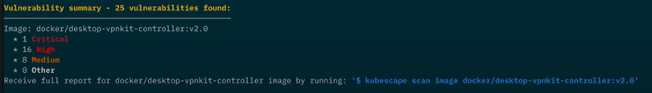
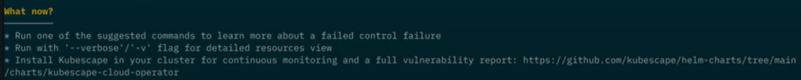

# Kubescape 3.0: Introducing Workload Scanning

Kubescape 3.0 introduces workload scanning, which allows you to comprehensively report on the security posture of individual workloads running in a Kubernetes cluster. This includes both misconfiguration and vulnerability scanning. This scan results in information that gives a 360° assessment of your workload’s security posture.

Watch a short video for a demonstration of workload scanning and its benefits, or read on.

<div class="video-wrapper">
  <iframe width="640" height="360" src="https://www.youtube.com/embed/N13jDFBAy7w?si=6KC2njGeCbSfzZRJ" title="YouTube video player" frameborder="0" allow="accelerometer; autoplay; clipboard-write; encrypted-media; gyroscope; picture-in-picture; web-share" allowfullscreen></iframe>
</div>

<!-- more -->

## What’s new and how to?

To scan a workload, simply run the following command:

```
kubescape scan workload -n <namespace> <kind>/<name>
```

For example, to scan a Deployment named "my-deployment", you would run the following command:

```
kubescape scan workload Deployment/my-deployment
```

## Workload configuration scanning

At the top of the scan results, you will see the configuration scan results. These results are grouped by specific areas of concerns, such as security, networking, and secrets.

Kubescape also provides links to documentation for each misconfiguration, so that you can easily learn more about the issue and how to fix it.

<figure markdown>
  { width="600" }
  <figcaption>Configuration scan results in the Kubescape CLI</figcaption>
</figure>

## Workload vulnerability scanning 

In addition to configuration scanning, Kubescape 3.0 also scans the images that your workloads run. This is important because container images are often the weakest link in the security chain.

If Kubescape finds any vulnerabilities in the images that your workloads run, it will display the results in the "Vulnerabilities" section of the scan results.


<figure markdown>
  { width="600" }
  <figcaption>Image scan results in the Kubescape CLI</figcaption>
</figure>

## A helping hand

Security scan results can be overwhelming and confusing. To lighten this cognitive load and ensure that you make the greatest security impact with your work, Kubescape also provides a "What Now?" section. It provides concrete steps on how to improve the security of the workload. For example, Kubescape may suggest running a more detailed image scan or reviewing the documentation for a particular control.


<figure markdown>
  { width="600" }
  <figcaption>Guided next steps in the "What now?" section</figcaption>
</figure>

# Benefits

* **Comprehensive scanning**: Kubescape scans workloads for both misconfigurations and vulnerabilities, giving you a complete view of their security posture with a single command.

* **Easy to use**: Kubescape's CLI is simple and intuitive to use, making it easy to scan workloads and understand the results.

* **Actionable insights**: Kubescape provides clear and concise explanations of each issue, as well as links to documentation on how to fix it.

* **CI/CD integration**: Kubescape can be easily integrated into CI/CD pipelines to stop broken images from being deployed.

# Conclusion

Workloads are at the heart of what you do. They hold the business value you bring your customers. They should be secure. A holistic view of your workload security, with clear guidelines on how to patch security issues and which issues to address first is key. Make the most of your security engineering time with Kubescape workload scanning. Try Kubescape today!

Please feel free to [raise any issues in the Kubescape GitHub project](https://github.com/kubescape/kubescape/issues) or ask questions [in our Slack channel](https://kubescape.io/project/community/#slack).

Are you enjoying Kubescape? [Please fill in our user survey!](https://kubescape.io/project/survey/)
