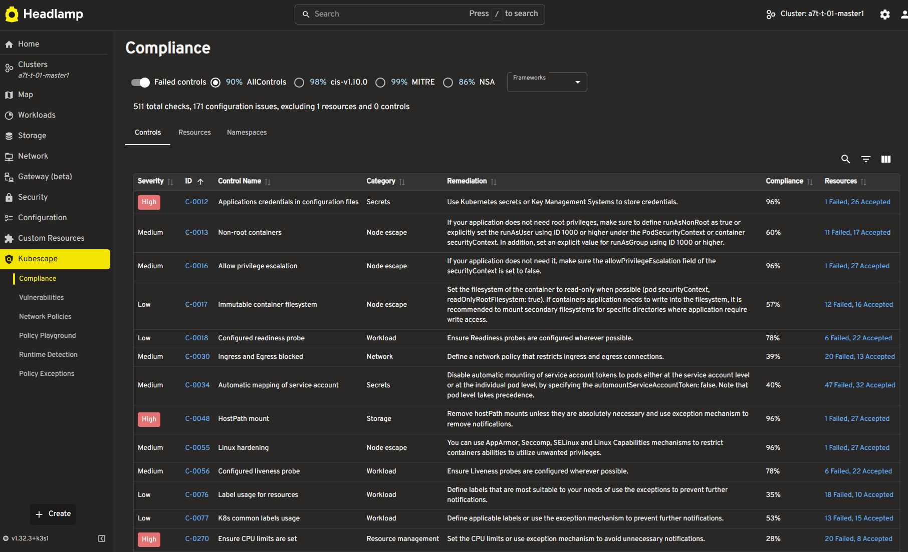

# Introducing a Visual Way to Explore Kubernetes Security: the Kubescape Plugin for Headlamp

Managing security in Kubernetes can feel like navigating a maze. With countless vulnerabilities, policies, and best practices to juggle, it’s easy for developers to get overwhelmed and hard to know where to start. Reporting on your security posture adds another layer of complexity-especially when many open-source tools are highly technical and not user-friendly for the average Kubernetes user.

That’s where Headlamp comes in. Headlamp is an open-source Kubernetes UI that provides an intuitive, visual way to explore and manage your clusters. It helps users of all experience levels understand what’s happening in their environments, surfacing insights that would otherwise require deep command-line expertise.

## Announcing the Kubescape Plugin for Headlamp

We’re excited to share the new Kubescape plugin for Headlamp, a game-changer for anyone looking to simplify Kubernetes security management! As Viktor Farcic noted at KubeCon NA 2024, “What Kubescape needs is a GUI.”

This plugin bridges the gap between robust security scanning and accessible, actionable insights. By reading reports from Kubescape, it brings security and compliance data directly into the Headlamp interface. Now, you can view and manage your cluster’s security posture without switching between tools or deciphering command-line outputs.

## What Can You Do with the Kubescape Plugin?

The Kubescape plugin enhances Headlamp with dedicated pages and features for:

- Configuration Scanning: Instantly see compliance and configuration scan results, making it easier to spot and address misconfigurations.

- Vulnerability Scanning: Get clear insights into vulnerabilities and CVEs (Common Vulnerabilities and Exposures) affecting your clusters and images.

- Network Policies Viewer: Visualize and manage network policies to strengthen your cluster’s security boundaries.

- Admission Policies Playground: Test and validate admission policies as recommended by Kubescape. The playground leverages WASM to evaluate CEL expressions in real-time, empowering you to experiment safely.

- Multi-Tenant Support: Enjoy namespace-specific views for multi-tenant clusters, so teams can focus on what matters to them.

<figure markdown>
  { width="600" }
  <figcaption>Source: Kubescape plugin for Headlamp PoC</figcaption>
</figure>

## Getting Started: How to Install the Kubescape Plugin

Ready to try it out? Here’s a quick guide to getting the Kubescape plugin up and running in Headlamp.

### Kubescape

Follow the [Kubescape operator installation procedure](https://kubescape.io/docs/install-operator/) and make sure you enable continuousScan `--set capabilities.continuousScan=enable` and network observability `--set capabilities.networkPolicyService=enable`.

### Headlamp Desktop App​

If you are using Headlamp as a desktop app (Windows, Mac, or Linux), go to the Plugin Catalog (available from the sidebar when in the home view), then look for the Kubescape plugin from the list, click it to see its details, and then click the install button. After the plugin is installed, use the notification to reload Headlamp.

### Headlamp Web app​

If you are deploying Headlamp as a web app (running in-cluster), you need to add the plugin files to the plugins folder of the headlamp-server. The Helm chart of Headlamp allows you to add an init container that will download the plugin. Please check the instructions at [Kubescape plugin for Headlamp](https://github.com/kubescape/headlamp-plugin/).

## Acknowledgements & Future

A huge thanks to the Headlamp team for providing an extensible multi-cluster K8s dashboard experience, and Kubescape team for building such a powerful tool for security posture management.

The Kubescape plugin for Headlamp is currently in beta and ready for you to test. We’re eager to hear your feedback and ideas let us know what you think!

With this new integration, Kubernetes security is more accessible than ever. Dive in, explore your clusters visually, and take control of your security posture today!
