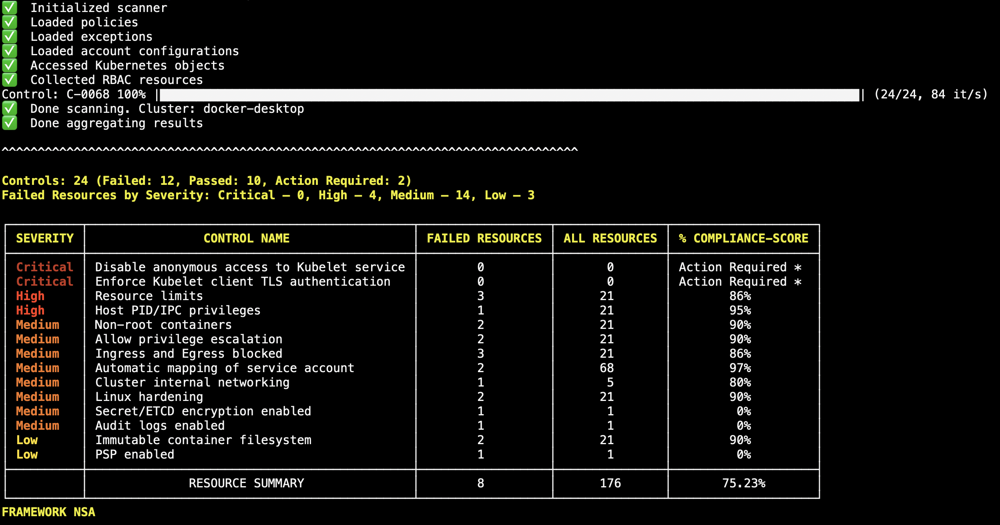

# Getting started with Kubescape

Kubescape can be used as a command line tool, as an operator inside a cluster, as part of a CI/CD process, or in many more places.  

The easiest way to get started with Kubescape is to download it to the machine you use to manage your Kubernetes cluster.

## Install Kubescape

```sh
curl -s https://raw.githubusercontent.com/kubescape/kubescape/master/install.sh | /bin/bash
```

(Kubescape is a security product; please read the file before you run it!)

## Run your first scan

Kubescape started out as a tool to validate a cluster against the [NSA hardening guidance](frameworks-and-controls/frameworks.md#nsa), so let's start by checking how well your cluster and its workloads are configured.

```sh
kubescape scan framework nsa
```

You will see output like this:

<figure markdown>
  
  <figcaption>The results of an NSA framework scan.</figcaption>
</figure>

Let's break down what this shows.

### Overview

This framework consists of 24 controls:

* 12 controls failed. This means at least one object in the cluster did not meet the requirements of the control.
* 10 controls passed.
* 2 controls require [configuration](frameworks-and-controls/configuring-controls.md) before they can be evaluated.

The number of controls that failed are also listed by severity.

### Output table

* **Severity** is the severity of a control failure, as specified in its framework.
* **Control name** is the name of the control.
* **Failed resources** is the number of resources that caused a particular control to fail. A control will be tested against every compatible resource in a cluster.
* **All resources** shows the number of resources that were available.
* **% compliance score** shows the [control compliance score](frameworks-and-controls/frameworks.md#using-frameworks-for-compliance) for that control.

### Resource summary

The summary then shows the total number of resources that caused control failures. To view each one and see Kubescape's suggestion on how to fix the failure, run again with `--verbose`.

A total compliance score for the framework is also displayed.

Now, [learn more about scanning with Kubescape](scanning.md).

## Next steps

* [Install the Kubescape Operator in your cluster for continuous scan results](install-operator.md)
* [Perform a cluster overview scan](scanning.md#the-overview-scan)
* [Configure controls](frameworks-and-controls/configuring-controls.md)