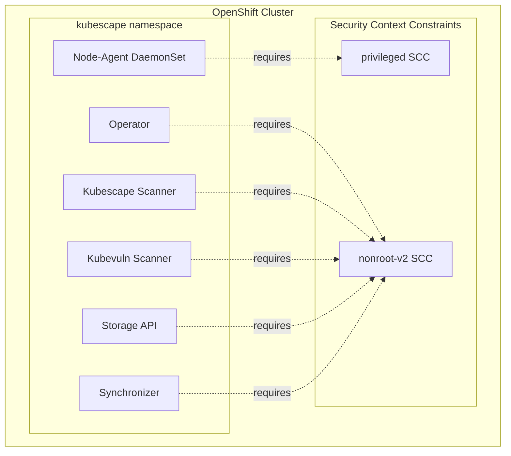
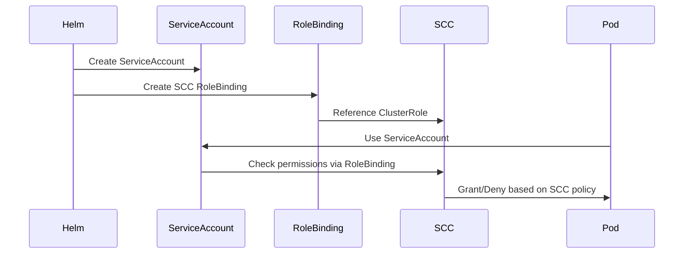

# Deploying Kubescape on OpenShift

## Introduction

This guide provides step-by-step instructions for deploying Kubescape on OpenShift, including Azure Red Hat OpenShift (ARO), Red Hat OpenShift on AWS (ROSA), OpenShift Container Platform (OCP), and OKD (the community distribution).

Kubescape has been specifically designed to work with OpenShift's enhanced security model, including Security Context Constraints (SCCs), SELinux enforcement, and OpenShift-specific APIs.

## Key Differences from Standard Kubernetes

OpenShift introduces additional security layers compared to standard Kubernetes:

- **Security Context Constraints (SCCs)**: OpenShift's equivalent to Pod Security Standards, providing fine-grained control over pod permissions
- **SELinux**: Enforced by default on Red Hat Enterprise Linux CoreOS (RHCOS) nodes
- **Routes**: OpenShift's native ingress alternative (though Ingress is also supported)
- **Integrated registry**: Built-in container image registry

## Prerequisites

Before installing Kubescape on OpenShift, ensure you have:

- **OpenShift cluster** (version 4.10 or later recommended)
  - Azure Red Hat OpenShift (ARO)
  - Red Hat OpenShift on AWS (ROSA)
  - OpenShift Container Platform (OCP)
  - OKD (community distribution)
- **Cluster admin access**: Required to create SCCs and cluster-wide resources
- **Helm 3.x**: For installing the Kubescape operator
- **oc CLI**: OpenShift command-line tool (includes kubectl functionality)
- **Sufficient resources**: See [resource requirements](#resource-requirements)

### Resource Requirements

Kubescape requires:

- **Node-agent** (DaemonSet): Runs on every node
  - 200m CPU, 256Mi memory (per node)
- **Operator**: 1 replica
  - 100m CPU, 128Mi memory
- **Kubescape scanner**: 1 replica
  - 500m CPU, 500Mi memory
- **Storage**: 1 replica
  - 100m CPU, 128Mi memory
- **Kubevuln**: 1 replica
  - 500m CPU, 500Mi memory

## Understanding OpenShift Security Context Constraints

### What are SCCs?

Security Context Constraints (SCCs) are OpenShift's mechanism for controlling the actions that pods can perform and what resources they can access. They are similar to Kubernetes Pod Security Standards but provide more granular control.

### Kubescape's SCC Requirements

Kubescape components require different SCC permissions:

| Component | SCC Required | Reason |
|-----------|-------------|--------|
| **node-agent** | `privileged` | Requires host-level access for runtime detection, eBPF probes, and container inspection |
| **operator** | `nonroot-v2` | Runs as non-root user with minimal permissions |
| **kubescape** | `nonroot-v2` | Scanner runs as non-root user |
| **kubevuln** | `nonroot-v2` | Vulnerability scanner runs as non-root user |
| **storage** | `nonroot-v2` | API server runs as non-root user |
| **synchronizer** | `nonroot-v2` | Sync service runs as non-root user |
| **otel-collector** | `nonroot-v2` | Telemetry collector runs as non-root user |

### SCC Architecture



### How SCC Role Bindings Work



When `global.openshift.scc.enabled=true`, the Helm chart creates RoleBindings that grant service accounts access to the appropriate SCCs.

## Installation on OpenShift

### Step 1: Add the Kubescape Helm Repository

```bash
helm repo add kubescape https://kubescape.github.io/helm-charts/
helm repo update
```

### Step 2: Install Kubescape with OpenShift Support

**Critical**: You must set `global.openshift.scc.enabled=true` to enable OpenShift SCC support.

```bash
helm install kubescape kubescape/kubescape-operator \
  -n kubescape --create-namespace \
  --set clusterName=$(oc config current-context) \
  --set capabilities.runtimeDetection=enable \
  --set alertCRD.installDefault=true \
  --set global.openshift.scc.enabled=true
```

### Installation Parameters Explained

| Parameter | Value | Purpose |
|-----------|-------|---------|
| `global.openshift.scc.enabled` | `true` | **Required**: Enables SCC role bindings |
| `clusterName` | Your cluster name | Identifies your cluster in reports |
| `capabilities.runtimeDetection` | `enable` | Enables runtime threat detection |
| `alertCRD.installDefault` | `true` | Installs default runtime alert policies |
| `capabilities.continuousScan` | `enable` | (Optional) Enables continuous scanning |

### Step 3: Verify Installation

Wait for all pods to be running:

```bash
oc get pods -n kubescape -w
```

Expected output:
```
NAME                         READY   STATUS    RESTARTS   AGE
kubescape-6dc4845cc6-xxxxx   1/1     Running   0          2m
kubevuln-5d745d744c-xxxxx    1/1     Running   0          2m
node-agent-xxxxx             1/1     Running   0          2m
node-agent-xxxxx             1/1     Running   0          2m
node-agent-xxxxx             1/1     Running   0          2m
operator-6c5669d565-xxxxx    1/1     Running   0          2m
storage-7f9ff84d57-xxxxx     1/1     Running   0          2m
```

### Step 4: Verify SCC Role Bindings

Check that SCC role bindings were created correctly:

```bash
oc get rolebinding -n kubescape | grep scc
```

Expected output:
```
kubescape-scc       ClusterRole/system:openshift:scc:nonroot-v2    2m
kubevuln-scc        ClusterRole/system:openshift:scc:nonroot-v2    2m
node-agent-scc      ClusterRole/system:openshift:scc:privileged    2m
operator-scc        ClusterRole/system:openshift:scc:nonroot-v2    2m
storage-scc         ClusterRole/system:openshift:scc:nonroot-v2    2m
synchronizer-scc    ClusterRole/system:openshift:scc:nonroot-v2    2m
```

### Step 5: Verify SCC Assignments

Check which SCC is being used by each pod:

```bash
oc get pod -n kubescape -o jsonpath='{range .items[*]}{.metadata.name}{"\t"}{.metadata.annotations.openshift\.io/scc}{"\n"}{end}'
```

Expected output:
```
kubescape-xxxxx       nonroot-v2
kubevuln-xxxxx        nonroot-v2
node-agent-xxxxx      privileged
operator-xxxxx        nonroot-v2
storage-xxxxx         nonroot-v2
```

The node-agent should be using the `privileged` SCC, while all other components use `nonroot-v2`.

## Runtime Detection Validation

### Enable Runtime Detection

Runtime detection should be enabled during installation with:
```bash
--set capabilities.runtimeDetection=enable
--set alertCRD.installDefault=true
```

### Verify Runtime Alert Policies

Check that default runtime alert policies are installed:

```bash
oc get runtimerulealertbinding -A
```

Expected output:
```
NAME                 AGE
all-rules-all-pods   5m
```

### Check Runtime Detection Status

View node-agent logs to confirm runtime detection is active:

```bash
oc logs -n kubescape -l app=node-agent --tail=50
```

Look for messages like:
```
{"level":"info","msg":"RulesWatcher - synced rules from cluster","enabledRules":22}
{"level":"info","msg":"RBCache - refreshed rule bindings rules","ruleBindings":1}
```

## Viewing Scan Results

### Configuration Scanning

View configuration scan summaries:

```bash
# Summary by namespace
oc get workloadconfigurationscansummaries

# Detailed reports
oc get workloadconfigurationscans -A
```

### Vulnerability Scanning

View vulnerability scan results:

```bash
# Summary by namespace
oc get vulnerabilitysummaries

# Detailed vulnerability reports
oc get vulnerabilitymanifests -A
```

### Runtime Alerts

View runtime security alerts (if any have been triggered):

```bash
# Check for application activities
oc get applicationactivities -A

# Check for network neighborhoods
oc get networkneighborhoods -A

# View generated network policies
oc get generatednetworkpolicies -A
```

## Troubleshooting

### SCC Permission Errors

**Symptom**: Pods fail to start with SCC-related errors in events

```bash
oc describe pod <pod-name> -n kubescape
```

**Error example**:
```
Error: container has runAsNonRoot and image has non-numeric user (node-agent), cannot verify user is non-root
```

**Solution**: Verify that `global.openshift.scc.enabled=true` was set during installation:

```bash
helm get values kubescape -n kubescape | grep openshift
```

If not enabled, upgrade the installation:

```bash
helm upgrade kubescape kubescape/kubescape-operator \
  -n kubescape \
  --reuse-values \
  --set global.openshift.scc.enabled=true
```

### Node-Agent Not Starting

**Symptom**: node-agent pods are in CrashLoopBackOff or Error state

**Check SCC assignment**:

```bash
oc get pod -n kubescape -l app=node-agent -o yaml | grep -A 5 "annotations:"
```

The node-agent must be assigned the `privileged` SCC:

```yaml
annotations:
  openshift.io/scc: privileged
```

**If using wrong SCC**:

1. Verify the SCC role binding exists:
   ```bash
   oc get rolebinding node-agent-scc -n kubescape -o yaml
   ```

2. Check that it references the privileged SCC:
   ```yaml
   roleRef:
     kind: ClusterRole
     name: system:openshift:scc:privileged
   ```

3. If missing or incorrect, reinstall with OpenShift support enabled.

### SELinux Denials

**Symptom**: Pods running but with permission denied errors in logs

**Check for SELinux denials**:

```bash
# On the node where the pod is running
oc debug node/<node-name>
chroot /host
ausearch -m avc -ts recent | grep kubescape
```

**Common SELinux issues**:

- Container trying to access host paths not allowed by SELinux
- Socket access denied

**Solution**: The node-agent is configured to run with SELinux type `spc_t` (super privileged container), which should allow necessary access. If issues persist, check:

```bash
oc get pod -n kubescape -l app=node-agent -o yaml | grep seLinux
```

### Storage Provisioning Issues

**Symptom**: Storage pod fails to start due to PVC not binding

**Check PVC status**:

```bash
oc get pvc -n kubescape
```

**Common causes**:

1. **No default StorageClass**: OpenShift should have a default storage class

   ```bash
   oc get storageclass
   ```

   Look for one marked as `(default)`.

2. **Insufficient permissions**: Check events

   ```bash
   oc get events -n kubescape --sort-by='.lastTimestamp'
   ```

**Solution**: Ensure a default StorageClass exists or specify one during installation:

```bash
--set persistence.storageClass=<your-storage-class>
```

### Checking Pod Events

For any pod issues:

```bash
oc describe pod <pod-name> -n kubescape
```

Look at the Events section at the bottom for error messages.

### Viewing Component Logs

```bash
# Operator logs
oc logs -n kubescape -l app=operator

# Kubescape scanner logs
oc logs -n kubescape -l app=kubescape

# Kubevuln logs
oc logs -n kubescape -l app=kubevuln

# Node-agent logs (on specific node)
oc logs -n kubescape -l app=node-agent --selector=<node-name>
```

## OpenShift-Specific Features

### Integration with OpenShift Routes

While Kubescape primarily uses services for internal communication, you can expose the storage API using OpenShift Routes if needed:

```bash
oc expose service storage -n kubescape
oc get route storage -n kubescape
```

### OpenShift Image Registry Scanning

Kubescape can scan images in the OpenShift internal registry:

```yaml
imageScanning:
  privateRegistries:
    credentials:
      - registry: "image-registry.openshift-image-registry.svc:5000"
        # Use pull secret from namespace or provide credentials
```

### Integration with OpenShift Monitoring

Kubescape can export metrics that integrate with OpenShift's built-in Prometheus monitoring:

```bash
helm upgrade kubescape kubescape/kubescape-operator \
  -n kubescape \
  --reuse-values \
  --set capabilities.prometheusExporter=enable \
  --set configurations.prometheusAnnotations=enable
```

Then metrics will be automatically scraped by OpenShift's monitoring stack.

## Platform-Specific Notes

### Azure Red Hat OpenShift (ARO)

- ARO runs on Azure-managed infrastructure
- Uses Azure Active Directory for authentication
- All management plane components are managed by Microsoft and Red Hat
- Ensure adequate Azure quotas (requires 44+ vCPUs for cluster)

### Red Hat OpenShift on AWS (ROSA)

- Similar to ARO but on AWS infrastructure
- Uses AWS IAM for additional permissions
- Integrated with AWS CloudWatch for logging

### OpenShift Container Platform (OCP)

- Self-managed OpenShift
- You control all aspects of the cluster
- May have custom security policies or SCCs

### OKD (Community Distribution)

- Open-source upstream of OpenShift
- May have slightly different default configurations
- Same SCC requirements apply

## Testing Runtime Detection

### Deploy Test Workload

Create a test deployment to verify runtime detection:

```bash
cat <<EOF | oc apply -f -
apiVersion: apps/v1
kind: Deployment
metadata:
  name: test-app
  namespace: default
spec:
  replicas: 1
  selector:
    matchLabels:
      app: test-app
  template:
    metadata:
      labels:
        app: test-app
    spec:
      containers:
      - name: nginx
        image: nginx:latest
        ports:
        - containerPort: 80
EOF
```

### Trigger Runtime Alerts

Execute a command in the pod to trigger runtime detection:

```bash
POD=$(oc get pod -l app=test-app -o jsonpath='{.items[0].metadata.name}')
oc exec $POD -- sh -c "ls /etc/shadow"
```

This should trigger a runtime alert for accessing sensitive files.

### View Runtime Alerts

Check if alerts were generated:

```bash
# Check application activities
oc get applicationactivities -n default

# Check network neighborhoods
oc get networkneighborhoods -n default

# View node-agent logs for alert events
oc logs -n kubescape -l app=node-agent --tail=100 | grep -i alert
```

## Cleanup and Uninstallation

### Uninstall Kubescape

```bash
helm uninstall kubescape -n kubescape
```

### Remove CRDs (Optional)

Helm does not automatically remove CRDs. If you want to completely remove Kubescape:

```bash
oc delete crd workloadconfigurationscans.spdx.softwarecomposition.kubescape.io
oc delete crd workloadconfigurationscansummaries.spdx.softwarecomposition.kubescape.io
oc delete crd vulnerabilitymanifests.spdx.softwarecomposition.kubescape.io
oc delete crd vulnerabilitymanifestsummaries.spdx.softwarecomposition.kubescape.io
oc delete crd vulnerabilitysummaries.spdx.softwarecomposition.kubescape.io
oc delete crd generatednetworkpolicies.spdx.softwarecomposition.kubescape.io
oc delete crd applicationactivities.spdx.softwarecomposition.kubescape.io
oc delete crd applicationprofiles.spdx.softwarecomposition.kubescape.io
oc delete crd networkneighborhoods.spdx.softwarecomposition.kubescape.io
oc delete crd seccompprofiles.kubescape.io
```

### Delete Namespace

```bash
oc delete namespace kubescape
```

## Additional Resources

- [Kubescape Documentation](https://kubescape.io)
- [OpenShift Security Context Constraints Documentation](https://docs.openshift.com/container-platform/latest/authentication/managing-security-context-constraints.html)
- [Kubescape GitHub Repository](https://github.com/kubescape/kubescape)
- [Helm Chart Repository](https://github.com/kubescape/helm-charts)

## Support

For issues specific to OpenShift deployment:

- Check the [Kubescape GitHub Issues](https://github.com/kubescape/kubescape/issues)
- Join the [CNCF Slack #kubescape channel](https://cloud-native.slack.com/archives/C04EY3ZF9GE)
- For Red Hat OpenShift support, contact Red Hat Support with Kubescape-related questions
