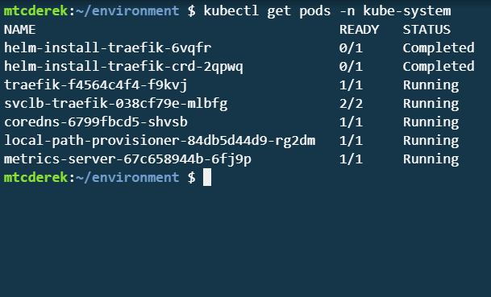
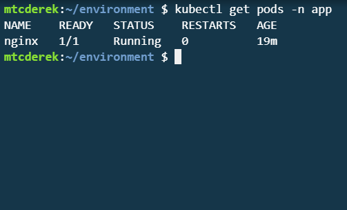
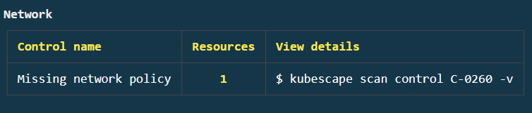
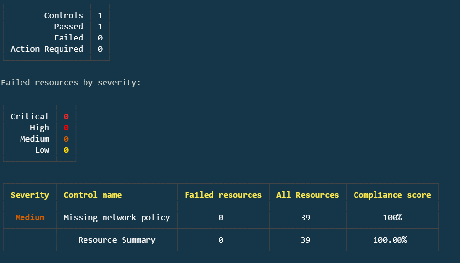
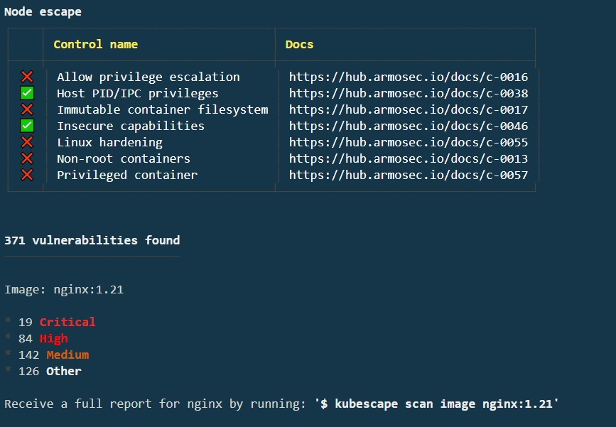
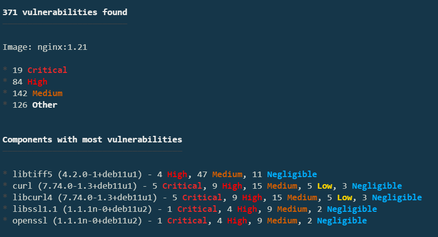
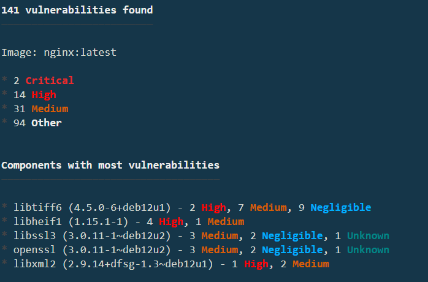

# Hardening Kubernetes workloads with the Kubescape command-line tool

## Intro

Using tools such as Kubescape to help remediate security issues in your cluster is crucial to any security plan. With Kubescape, you can scan your manifests, Helm charts, or active clusters for compliance with [security frameworks](../frameworks-and-controls/) such as NSA, MITRE, SOC 2, and more. 
There are several ways to run Kubescape, including a command-line tool, an in-cluster Operator, a Visual Studio Code integration, and a GitHub action. In this guide, you will use the Kubescape command-line tool (CLI) to illustrate hardening a running Kubernetes cluster with a simple deployment. Since the Kubescape CLI is agentless, it doesn’t have as much insight into the cluster as the operator does. However, it’s still a potent tool.

## Deploy a Cluster
In this example, you will use a Kubernetes cluster deployed with K3s. Any cluster will do as long as it supports a local container image registry and basic Kubectl commands. If you don’t have a cluster meeting those criteria, you can set one up using the following instructions.

### Install K3s

First, install K3s. Use the `--write-kubeconfig-mode 644` flag to allow Kubescape and non-root users to access the Kubeconfig file without `sudo`. By default, the Kubeconfig file is owned by root with privileges of `600`. The complete list of K3s configuration options can be found [here](https://docs.k3s.io/cli/server).

```curl -sfL https://get.k3s.io | sh -s - --write-kubeconfig-mode 644```

Now, configure the KUBECONFIG environment variable to point to the default location of the K3s configuration:


```export KUBECONFIG=/etc/rancher/k3s/k3s.yaml```

Verify the cluster is up:



## Deploy a Pod
For this deployment, we will use a very simple NGINX container. 

### Create the Manifest

```touch nginx-app.yml```

#### nginx-app.yml

```
---
apiVersion: v1
kind: Namespace
metadata:
  name: app
  labels:
    name: app
---
apiVersion: v1
kind: Pod
metadata:
  name: nginx-app
  namespace: app
spec:
  containers:
  - name: nginx
    image: nginx:1.21
    ports:
    - containerPort: 80
    imagePullPolicy: Always
    securityContext:
        privileged: true
```

### Deploy the Pod
#### Deploy
```
kubectl apply -f nginx-app.yml
```
#### Verify
```
kubectl get pods -n app
```


Great! Now that your cluster is set up and your pod is deployed, use Kubescape to harden it.

## Use the Kubescape CLI to Detect Cluster Security Issues

### Kubescape Scan
First, install Kubescape. Do so by running the script below:
```
curl -s https://raw.githubusercontent.com/kubescape/kubescape/master/install.sh | /bin/bash
```
Now, run the scan and view the output:
```
kubescape scan
```


Alright, the scan is finished. There’s a lot of output to go through. Using kubescape scan without any modifiers runs a scan using the MITRE and NSA frameworks. As you scroll down, you can see several of the controls scanned and their results. At the bottom, you’ll see your overall compliance score and the highest-stakes workloads:


This guide will not focus on the Traefik control failures but will address the Pod/nginx-app issue soon. First, knock out one of the "Network" control failures. 

### Remediate a Network Control Failure
The scan results are divided into sections based on their type. If you scroll through the results, you’ll see a "Network" failure indicating that there are "Missing network policies.":



Run `kubescape scan control C-0260 -v` as indicated by the error, and you’ll see where the issues lie and be given more information on how to remediate them:


As you can see, if your terminal allows, there is a clickable link to the documentation that provides more information. In this case, it’s located at [https://hub.armosec.io/docs/c-0260](https://hub.armosec.io/docs/c-0260). Based on the information found in the ARMO documentation and the [K3s Hardening Guide](https://ranchermanager.docs.rancher.com/reference-guides/rancher-security/hardening-guides/k3s-hardening-guide#network-policies), create this network policy which will isolate network traffic within the cluster to its respective namespace:

#### netpol.yml

```
---
kind: NetworkPolicy
apiVersion: networking.k8s.io/v1
metadata:
  name: intra-namespace
  namespace: kube-system
spec:
  podSelector: {}
  ingress:
    - from:
      - namespaceSelector:
          matchLabels:
            name: kube-system
---
kind: NetworkPolicy
apiVersion: networking.k8s.io/v1
metadata:
  name: intra-namespace
  namespace: default
spec:
  podSelector: {}
  ingress:
    - from:
      - namespaceSelector:
          matchLabels:
            name: default
---
kind: NetworkPolicy
apiVersion: networking.k8s.io/v1
metadata:
  name: intra-namespace
  namespace: kube-public
spec:
  podSelector: {}
  ingress:
    - from:
      - namespaceSelector:
          matchLabels:
            name: kube-public
---
kind: NetworkPolicy
apiVersion: networking.k8s.io/v1
metadata:
  name: intra-namespace
  namespace: app
spec:
  podSelector: {}
  ingress:
    - from:
      - namespaceSelector:
          matchLabels:
            name: app
```
Apply that policy:

```
kubectl apply -f netpol.yml
```

And run another scan for that control:
```
kubescape scan control C-0260 -v
```


Perfect! You have now remediated the C-0260 control failures. 

### Workload Scanning

Now that you’ve knocked out a relatively simple control, look at one of the highest-stake workloads and see if fixing it can improve the score. Re-run `kubescape scan`, and you’ll notice the compliance score has increased by a small amount thanks to the C-0260 remediation. Now, see if fixing an issue with `nginx-app` can improve the score further. 

Under the Highest-stake workload section, you’ll see a list of commands you can run to isolate those issues. Run the command to scan the Pod/nginx-app workload:

```
kubescape scan workload Pod/nginx-app --namespace app
```


You can remediate several issues. Remediate the "Privileged container" first. If you access the [C-0057 docs](https://hub.armosec.io/docs/c-0057), you’ll see a nice remediation example. In the `nginx-app.yml`, you can see that our `privileged` attribute is set to `true`. Sure, this is a relatively contrived and simple example, but it’s a pretty easy fix. In your `nginx-app.yml`, change the `privileged` attribute to `false`:

```
---
apiVersion: v1
kind: Namespace
metadata:
  name: app
  labels:
    name: app
---
apiVersion: v1
kind: Pod
metadata:
  name: nginx-app
  namespace: app
spec:
  containers:
  - name: nginx-app
    image: nginx:1.21
    ports:
    - containerPort: 80
    imagePullPolicy: Always
    securityContext:
        privileged: false
```
Since it's just a simple pod, delete and re-apply it:

```
kubectl delete -f nginx-app.yml && kubectl apply -f nginx-app.yml
```

Rerun the scan and you'll see that the `C-0057` control is remediated as indicated by the green check:

```
kubescape scan workload Pod/nginx-app --namespace app
```


### Image Scanning
For the final piece of the puzzle, scan the image and see if you can improve its security posture. At the bottom of the previous output, you should see "Receive a full report for nginx by running: `$ kubescape scan image nginx:1.21`. Run that command:
```
kubescape scan image nginx:1.21
```


There are definitely some issues here! With some research, you’ll notice that 1.21 is not the latest version of NGINX. Upgrade your manifest to use the latest version:
```
nginx:latest
```
After you have made the modification and saved the file, re-apply the manifest:
```
kubectl delete -f nginx-app.yml && kubectl apply -f nginx-app.yml
```
Finally, run `kubescape scan nginx:latest` to see the results. The results shown in the image are current as of the writing of this guide, so yours may differ:



Several vulnerabilities have been remediated! Unfortunately, not all of them, but that's the nature of security, and why you need a tool such as Kubescape. Your individual results will vary due to the current version and number of open vulnerabilities in NGINX when you’re going through this guide.

## Conclusion

In this guide, you have used Kubescape to scan a basic Kubernetes cluster for vulnerabilities, researched those vulnerabilities, and remediated them with a very straightforward process. Kubescape can also scan Helm manifests, Kustomize directories, and more. While this guide only scratches the surface, you can leverage Kubescape's CLI to harden your clusters to meet your own security requirements.
