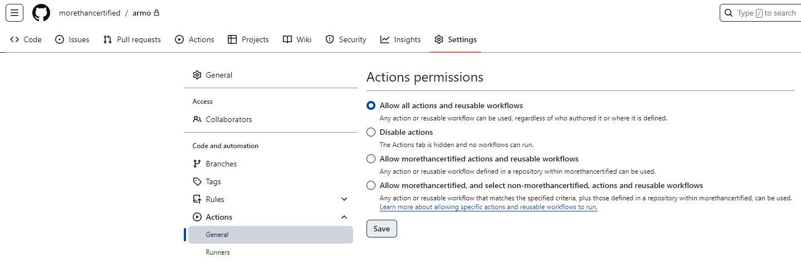
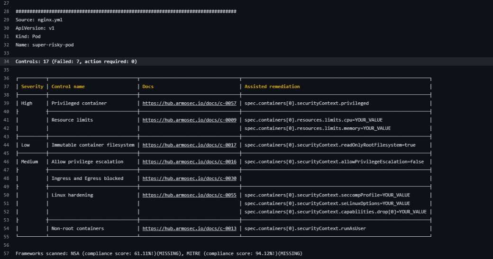
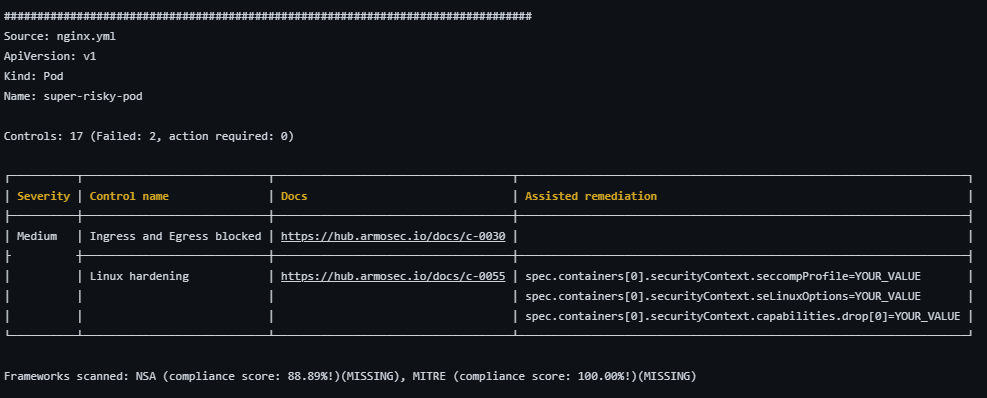
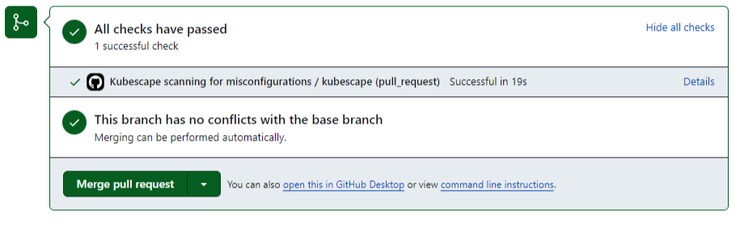
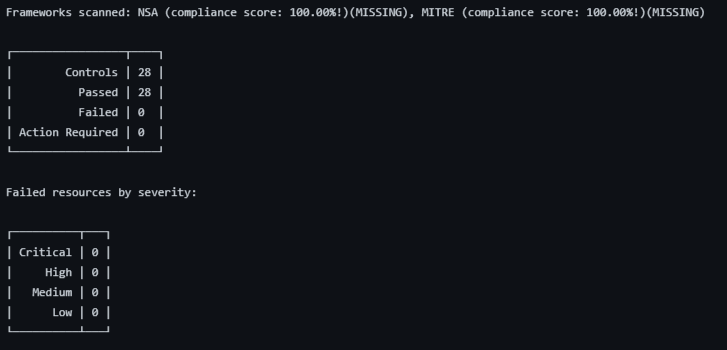

# Enforcing Security Policies in your Repositories using Kubescape


## Intro

Using tools such as Kubescape to help remediate security issues in your cluster is crucial to any security plan. With Kubescape, you can scan your manifests, Helm charts, or active clusters for compliance with security frameworks such as NSA, MITRE, SOC2, and more. While Kubescape significantly increases your security compliance with active clusters, it works even better when your scans are automatically run against any manifest files as soon as they are pushed to your repository and, ideally, before merging to the main branch. Let’s look at how to configure the GitHub Action to automatically run scans based on your chosen frameworks, ignore acceptable risks, and improve your security posture whenever a pull request is created against your repository. We use GitHub in this example, but you can apply the same principles to other Git vendors. 

## The Deployment
The Kubernetes manifest we’ll be scanning is a simple one. This way, we can focus on the task at hand, improving the security posture. If you’d like to follow along, go ahead and create a new repository and add a README.md file to the main branch. Pull the repo to your local IDE of choice. I’ll be using Codespaces through this tutorial to keep it simple. Once you’ve done that, let’s get GitHub Actions configured.

### Enable GitHub Actions

GitHub Actions is usually set by default, but just to be sure, head to “Settings,” “Actions,” and “General,” and ensure “Allow all actions and reusable workflows” is selected:


### Create the Action

Head to https://github.com/kubescape/github-action to see the documentation. Many of the Action examples shown require GitHub code scanning to be enabled. We'll remove that functionality in the following step since code scanning is only available in public and enterprise repositories. 

To create the action, you can use the GitHub UI or create the file manually. We’ll create the file manually within the IDE to keep things simple. 

Create a main.yml file within a newly created .github/workflows/ directory

`mkdir -p .github/workflows && touch .github/workflows/main.yml`

Open main.yml and paste in the following code to get us started:

```
name: Kubescape scanning for misconfigurations
on: [pull_request]
jobs:
  kubescape:
    runs-on: ubuntu-latest
    permissions:
      actions: read
      contents: read
      security-events: write
    steps:
    - uses: actions/checkout@v3
    - uses: kubescape/github-action@main
      continue-on-error: false
      with:
        frameworks: NSA,MITRE
        verbose: true
    severityThreshold: low
```

This is going to run the action any time there is a pull request in the repository. It will run the Kubescape CLI with the NSA Framework (PDF Link) and the MITRE Framework. To read more about the frameworks available, you can find that information here: https://kubescape.io/docs/frameworks-and-controls/frameworks/

I have also added a few other customizations to provide for verbose output and set the severityThreshold to ensure any controls will cause the action to fail. . 

Push this to your repository:

```
git add .
git commit -m "Added Kubescape Workflow"
git push -u origin main
```

### The Dev Branch and the Manifest

First, create a new branch called dev:

`git checkout -b dev`

We’re going to do a very simple manifest that will deploy a NGINX pod to start. Although simple, it still contains several security vulnerabilities, as you can see. Create a file called nginx.yml in the root directory of your repository and add the following:

```
apiVersion: v1
kind: Pod
metadata:
  name: super-risky-pod
spec:
  containers:
  - name: nginx
    image: nginx
    securityContext:
      privileged: true
      runAsUser: 0
```

### Create the PR

Now, we’re going to test the action! Create a new branch, commit the changes, and push to the new branch:

```
git add .
git commit -m "Added nginx.yml manifest"
git push origin dev
```

Now create the pull request. The --fill will use the commit message as the PR description. Feel free to change that using the --title and --body flags:

`gh pr create --fill`

You should see the pull request in your GitHub dashboard:


Open the pull request, and you should see “All checks have failed.” since we added insecure code:


Open the details, take a look, and you’ll see a full report with, at the time of this writing, seven failed controls and the links and assisted remediation for each:



If you click on each docs link, you can see the information about each control and how to remediate it. In the next section, we’ll use various methods to clean up these failures. 

## Remediation

### Corrections

Now that we’ve seen how bad our security footprint is for this pod, let’s start fixing the errors. In this example, we’re going to remediate for c-0057, c-0009, c-0017, c-0016, and c-0013. We’ll deal with c-0055 and c-0030 in the next step. 

Use the following content for nginx.yml and note the changes.

```
apiVersion: v1
kind: Pod
metadata:
  name: super-risky-pod
spec:
  securityContext:
    runAsUser: 1000
    runAsGroup: 1000
    fsGroup: 1000
  containers:
  - name: nginx
    image: nginx
    securityContext:
      allowPrivilegeEscalation: false
      readOnlyRootFilesystem: true
      # privileged: true
      # runAsUser: 0
    resources:
      requests:
        memory: "64Mi"
        cpu: "250m"
      limits:
        memory: "128Mi"
        cpu: "500m"
```

By using the docs, you can see pretty quickly how to remediate these issues. I’ll just comment out the removals for clarity, but obviously, you would delete the lines entirely in production. Let’s push these changes to our pull request and see how we did:

```
git add .
git commit -m "remediated security issues"
git push origin dev
```

This will kick off another run since it’s a modification to the same branch with an open pull request. Check out the details of the run to see how it went:


It appears we’ve fixed all but two control violations. We’ll look at how to ignore those in the next section. 

### Exceptions

Alright! Our remediation efforts went well. There are still two more risks to consider. Let’s say that, after consulting with your team, you’ve decided you aren’t concerned with them. Kubescape allows several options to ignore these. You can set the severityThreshold to ignore them, but since other controls are also of medium severity that you do care about, it’s probably best not to go that route. If you look at the Overall compliance-score at the bottom of the output, you see it’s a “93.” You can also set a failedThreshold to ignore that, but that option may also pose a risk depending on your requirements. To be more precise, let’s manually specify these controls in an exceptions file and instruct Kubescape to ignore them. 

Create an exceptions.json file and add the following content:

```
[
    {
        "name": "exclude-linux-hardening-policy-control",
        "policyType": "postureExceptionPolicy",
        "actions": [
            "alertOnly"
        ],
        "resources": [
            {
                "designatorType": "Attributes",
                "attributes": {
                    "kind": ".*"
                }
            }
        ],
        "posturePolicies": [
            {
                "controlID": "C-0055"
            }
        ]
    },
    {
        "name": "exclude-egress-and-ingress-blocked-policy-control",
        "policyType": "postureExceptionPolicy",
        "actions": [
            "alertOnly"
        ],
        "resources": [
            {
                "designatorType": "Attributes",
                "attributes": {
                    "kind": ".*"
                }
            }
        ],
        "posturePolicies": [
            {
                "controlID": "C-0030"
            }
        ]
    }
]
```

Now, add the following exceptions directive (highlighted in green) to the .github/workflows/main.yml file:

```
name: Kubescape scanning for misconfigurations
on: [pull_request]
jobs:
  kubescape:
    runs-on: ubuntu-latest
    permissions:
      actions: read
      contents: read
      security-events: write
    steps:
    - uses: actions/checkout@v3
    - uses: kubescape/github-action@main
      continue-on-error: false
      with:
        frameworks: NSA,MITRE
        verbose: true
        severityThreshold: low
        exceptions: exceptions.json
```

Let’s push the code and cross our fingers for all green checks!

```
git add .
git commit -m "added exceptions for c-0055 and c-0030"
git push origin dev
```



All green! If you click on the details and the Kubescape/github-action@main step, you’ll see a 100% pass:




You can now merge your PR and enjoy peace of mind that your cluster is secure, thanks to Kubescape!

## Conclusion
This has been a quick run-through of Kubescape’s GitHub Action. Although this was a simple scan, its power is scalable to extremely large production workloads and can help you keep your security footprint at a minimum. With a direct integration to the rest of the Kubescape ecosystem, such as the CLI, Cloud, and more, it is the ideal tool for maintaining your Kubernetes security. 
