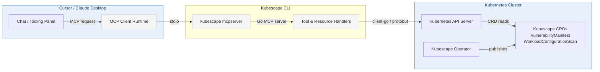
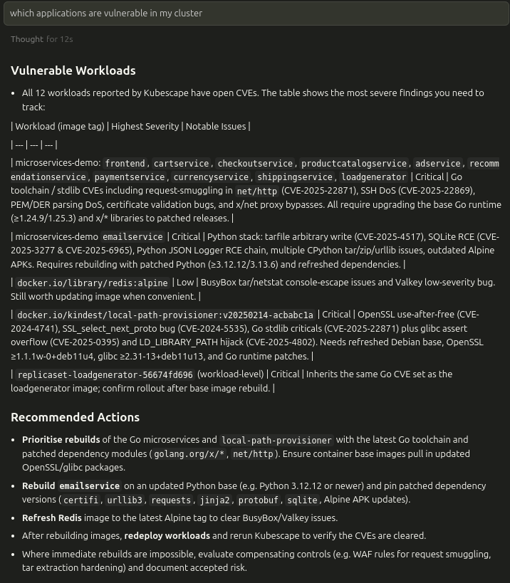

# Kubescape CLI as an MCP Server in Cursor

Kubescape exposes its Kubernetes security findings through an MCP (Model Context Protocol) server bundled inside the CLI. When you register this server in Cursor or Claude Desktop, the IDE can query live vulnerability and configuration data directly from your connected clusters.

### High Level Diagram




## Prerequisites
- `kubescape` CLI (a release that includes the `mcpserver` command, `beyond `v3.0.44`).
- Cursor version or Claude Desktop with MCP support enabled
- Reachable Kubernetes cluster with the Kubescape operator deployed and actively writing `VulnerabilityManifest` and `WorkloadConfigurationScan` resources.
- Local credentials for the cluster (`KUBECONFIG` or in-cluster context) allowing read access to Kubescape CRDs.

## Setup Steps
1. **Install Kubescape CLI**
   ```bash
   curl -s https://raw.githubusercontent.com/kubescape/kubescape/master/install.sh | /bin/bash
   ```

2. **Register the server in Cursor**
   Add (or update) your `.cursor/mcp.json` configuration:
   ```json
   {
     "servers": [
       {
         "name": "kubescape",
         "command": "/absolute/path/to/kubescape",
         "args": ["mcpserver"]
       }
     ]
   }
   ```
   Restart Cursor  or Claude Desktop to pick up the new MCP integration.

<!-- Screenshot placeholder: Cursor MCP configuration -->

## Available MCP Tools
- `list_vulnerability_manifests` — Enumerates all vulnerability manifests, filtered by `level` (`image`, `workload`, or `both`). Returns metadata and template URIs such as `kubescape://vulnerability-manifests/<ns>/<name>`.
- `list_vulnerabilities_in_manifest` — Lists CVEs contained within a specific manifest.
- `list_vulnerability_matches_for_cve` — Narrows down to workload/image matches for a given CVE.
- `list_configuration_security_scan_manifests` — Discovers configuration scan manifests per namespace.
- `get_configuration_security_scan_manifest` — Retrieves the full configuration scan payload for a workload.

Each response is returned as JSON text content, ready for follow‑up parsing in Cursor or downstream automations.



## Resource Templates
- `kubescape://vulnerability-manifests/{namespace}/{manifest_name}/cve_list` — Provides CVE inventory for a manifest.
- `kubescape://vulnerability-manifests/{namespace}/{manifest_name}/cve_details/{cve_id}` — Surfaces match details for a specific CVE.
- `kubescape://configuration-manifests/{namespace}/{manifest_name}` — Returns the full configuration scan document.

When Cursor accesses a template URI, the server pulls the corresponding CRD from the cluster and serializes it to JSON.

## Operational Notes
- The server disables client-go rate limiting and enforces protobuf content to lower latency to the cluster.
- Namespace defaults: tools assume `kubescape` when no namespace is supplied, but you can provide a specific namespace in each call.
- The MCP server exits when the hosting terminal session closes; restart it before opening Cursor if needed.

## Troubleshooting
- **Server fails to start**: verify the cluster credentials and that the Kubescape CRDs exist (`kubectl api-resources | grep vulnerabilitymanifest`).
- **Empty tool responses**: ensure the operator has published manifests and that the namespace filter matches the workloads you expect.
- **Cursor cannot reach the server**: confirm the binary path in `.cursor/mcp.json` and that the terminal running `kubescape mcpserver` is still active.

