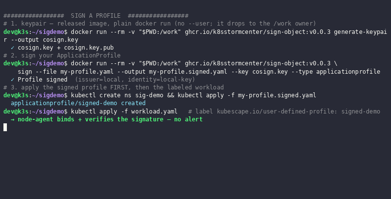

# Signing &amp; tamper detection (experimental)
A user-defined profile is an **allow-list** — whoever can edit it controls what the runtime treats
as "normal". Same goes for the CEL rules and the kubescape config. Which is why we decided to make them signable and bundlable.





For up-to-date examples, consult the 
component tests `Test_29` (a signed profile is accepted), `Test_30` (tampering invalidates the
signature), and `Test_31` (the R1016 alert fires).

## Implemented as annotation


The signature travels **with** the object, as an annotation. Kubescape verifies it on every
cache-load, so tampering is detected wherever it happens — `kubectl edit`, a compromised operator, a
malicious admission mutation.

## Try it yourself

Prerequisites: a cluster with Kubescape **sbob-rc3** installed (see the
[quickstart install](quickstart.md)), plus `kubectl`, `docker`, `jq`, and `yq`. 

```bash
export SIGN_OBJECT="ghcr.io/k8sstormcenter/sign-object:v0.0.3@sha256:f3d4e321fa62e0a4ca421ba59a3fce3f2ff88714aaf87a7d160322cb8ec2f92b"
sign_object() { docker run --rm -v "$PWD:/work" "$SIGN_OBJECT" "$@"; }
mkdir -p sbob-signing && cd sbob-signing
```

**1. Generate a keypair.**

```bash
sign_object generate-keypair --output cosign.key      # → cosign.key + cosign.key.pub
```

**2. Author a profile.** List only `execs` — omit empty fields, or storage's `[]→null` normalization breaks the signature.

```bash
cat > my-profile.yaml <<'EOF'
apiVersion: spdx.softwarecomposition.kubescape.io/v1beta1
kind: ApplicationProfile
metadata:
  name: signed-demo
  namespace: sig-demo
spec:
  architectures: ["amd64"]
  containers:
  - name: app
    execs:
    - { path: /bin/sleep, args: ["/bin/sleep", "infinity"] }
EOF
```

**3. Sign it.**

```bash
sign_object sign --file my-profile.yaml --output my-profile.signed.yaml \
  --key cosign.key --type applicationprofile
```

**4. Apply the signed profile first, then a workload that references it** by label.

```bash
kubectl create namespace sig-demo
kubectl apply -f my-profile.signed.yaml
sleep 5
kubectl apply -f - <<'EOF'
apiVersion: apps/v1
kind: Deployment
metadata: { name: signed-demo, namespace: sig-demo }
spec:
  replicas: 1
  selector: { matchLabels: { app: signed-demo } }
  template:
    metadata:
      labels:
        app: signed-demo
        kubescape.io/user-defined-profile: signed-demo
        kubescape.io/user-defined-network: signed-demo
    spec:
      containers:
      - { name: app, image: busybox:1.36, command: ["/bin/sleep", "infinity"] }
EOF
kubectl -n sig-demo rollout status deploy/signed-demo
```

node-agent binds and **verifies** the signature — no alert. Confirm it's quiet (expect `0`):

```bash
kubectl -n kubescape logs ds/node-agent | grep -c '"RuleID":"R1016"'
```

**5. Tamper.** Add `/bin/sh`, keep the old signature, and replace the profile — a completed profile can't be patched in place.

```bash
yq -i '.spec.containers[0].execs += [{"path":"/bin/sh","args":["/bin/sh"]}]' my-profile.signed.yaml
kubectl -n sig-demo delete applicationprofile signed-demo
kubectl apply -f my-profile.signed.yaml
```

**6. Bind the new profile and read R1016.** the current implementation [^backlog]

```bash
kubectl -n kubescape rollout restart ds/node-agent
sleep 30
kubectl -n kubescape logs ds/node-agent | grep '"RuleID":"R1016"' \
  | jq -c '{RuleID, alert: .BaseRuntimeMetadata.alertName, severity: .BaseRuntimeMetadata.severity, workload: .RuntimeK8sDetails.workloadName}'
```

```json
{"RuleID":"R1016","alert":"Signed profile tampered","severity":10,"workload":"signed-demo"}
```

Clean up: `cd .. && kubectl delete namespace sig-demo`.

[^backlog]: We currently have a backlog where the late-binding of profiles will be allowed. This requires a lot of testing and process-design, which is
why currently, you need to restart a pod to bind the whole process to a new profile (irrespective of signature).
This does not apply to the rules and config. That can be changed in real-time. 
Stay tuned for updates 🤓.


## Next

- **[What is a Bill of Behavior](index.md)** — the concept and the custom resources.
- **[Quickstart](quickstart.md)** — a live Log4Shell detection against a signed profile.
- **[Node Agent Rule Library](../node-agent-rule-library.md)** — the full rule catalog, including R1016.
