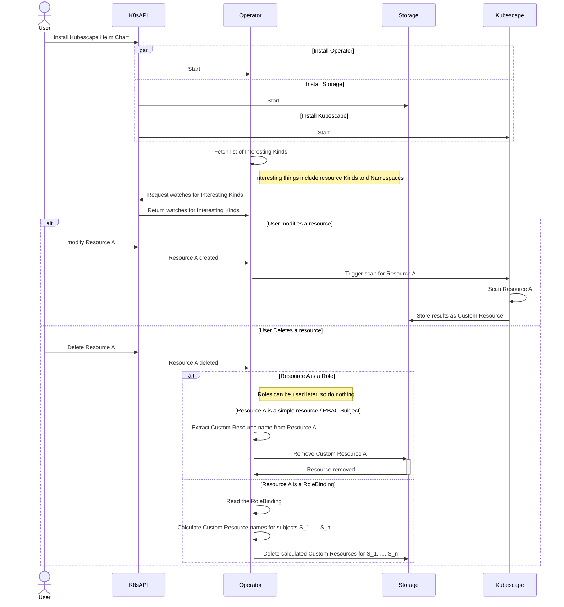

# Continuous Scanning

To let cluster operators see the current security posture of their cluster, Kubescape provides the Continuous Scanning feature. Once enabled, Kubescape will constantly monitor the cluster for changes, evaluate their impact on the overall cluster security and reflect its findings in the cluster-, namespace- and workload-scoped security reports. Essentially, this means you'll always get the latest scoop on your cluster’s security!

## Installation

Continuous Scanning is built into the Kubescape Operator Helm chart. To use this capability, you only need to enable it. You can enable it when installing Kubescape with a single command:

```
helm repo add kubescape https://kubescape.github.io/helm-charts/ ; helm repo update ; helm upgrade --install kubescape kubescape/kubescape-operator -n kubescape --create-namespace --set clusterName=`kubectl config current-context` --set capabilities.continuousScan=enable
```

Or, if you prefer managing your Helm releases with the `values.yaml` file, make sure that the corresponding `capabilities.continuousScan` key is set to `enabled`, like so:

```yaml
capabilities:
  continuousScan: enable  # Make sure this is set to "enable"
```

Once you roll out the release with the capability enabled, Kubescape will continuously secure your cluster and provide the scan results as Custom Resources.

## Accessing Results

### For the Whole Cluster

Kubescape provides scan results as Custom Resources so you can access them in the same convenient way you access other Kubernetes objects. Let’s assume you’d like to see a birds-eye view of you cluster’s security. In Kubescape terms, that would mean taking a look at the cluster-level configuration scan summary:

```
kubectl get workloadconfigurationscansummaries -o yaml
```

Running this command will return a YAML-formatted list of configuration scan summaries for your cluster by namespaces.

On clusters with many namespaces, the results might be overwhelming and might even exceed your terminal history. Since Kubescape serves results as Kubernetes objects, which are YAML files at the end of the day, you can apply your usual processes to aggregate them in a readable way. For exampple - pipe them to files, text editors etc. We commonly use the following command:

```
kubectl get workloadconfigurationscansummaries -o yaml | less
```

This way you get the complete result in a file and can browse it as you see fit.

### By Namespace

Let’s say you have a namespace `k8s-bad-practices`. It runs badly misconfigured insecure workloads and you would like to see how Kubescape sees them. To get the configuration scan results for this namespace, run the following command:

```
kubectl get -n k8s-bad-practices workloadconfigurationscansummaries -o yaml | less
```

You should see a summary for the insecure namespace only.

### By Workload

You could also be interested in checking how secure a specific workload is. To see those results, use:

```
kubectl get -n k8s-bad-practices workloadconfigurationscansummaries trusty-reverse-proxy -o yaml | less
```

That should provide you with a configuration scan summary for this workload.

## How It Works

With Continuous Scanning enabled, Kubescape continuously monitors a cluster for changes, determines how they affect the security of your cluster and reflect their security impact in the overall cluster’s security report, as well as individual workload security reports. Let’s take a look at a sequence diagram.



