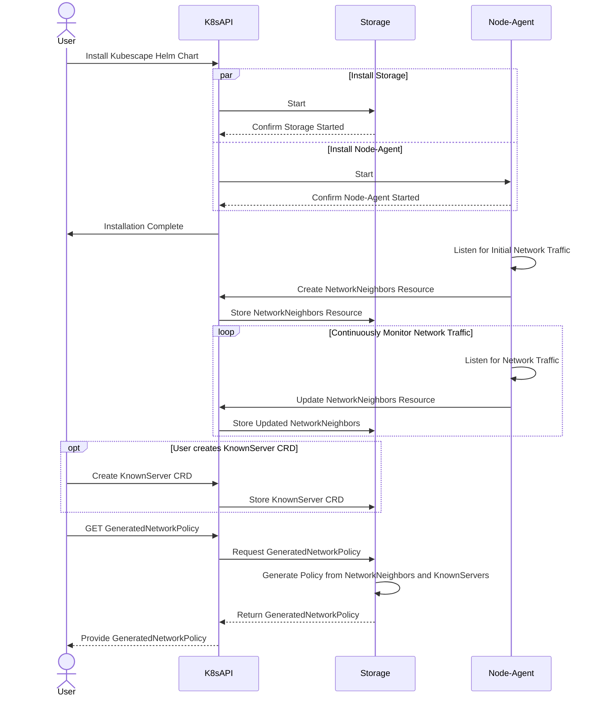

# Network Policy generation

Creating Network Policies for workloads running in a cluster is a very important step in securing your cluster. But doing so manually can be a very tedious and error-prone task.   
Kubescape provides a way to automatically generate Network Policies for your cluster. Once the Network Policy generation feature is enabled, Kubescape will listen to the network communication on your workloads, and you can then use `kubectl` to generate Network Policies automatically based on the captured traffic. Please note that the policies won't be applied to the cluster automatically. You will have to apply them manually.

## Installation 
Kubescape Network Policy generation is built into the Kubescape Operator Helm chart and is enabled by default. 
To `enable`/`disable` this capability, you need to `enable`/`disable` it when installing the chart:
```bash
--set capabilities.networkPolicyService=enable
```

Once you apply the chart with the capability enabled, Kubescape will continuously listen to the workloads traffic and you could then generate network policies for them.

## Network Policy generation

To generate a Network Policy for a workload, all you need to do is run the following command:
```
kubectl -n <namespace> get generatednetworkpolicies <workload-kind>-<workload-name> -o yaml
```
For example, if you want to generate a Network Policy for a `Deployment` named `nginx` in the `default` namespace, you would run the following command:
```
kubectl -n default get generatednetworkpolicies deployment-nginx -o yaml
```
This will return you a CRD of Kind `GeneratedNetworkPolicy`. This CRD will contain on its `spec` the generated Network Policy. You can then apply this Network Policy to your cluster.

This is an example of a generated CRD:
```yaml
apiVersion: spdx.softwarecomposition.kubescape.io/v1beta1
kind: GeneratedNetworkPolicy
metadata:
  creationTimestamp: "2023-12-12T08:46:30Z"
  labels:
    kubescape.io/workload-api-group: apps
    kubescape.io/workload-api-version: v1
    kubescape.io/workload-kind: deployment
    kubescape.io/workload-name: operator
    kubescape.io/workload-namespace: kubescape
    kubescape.io/workload-resource-version: "76459062"
  name: deployment-operator
  namespace: kubescape
policyRef:
- dns: report.armo.cloud.
  ipBlock: 16.171.184.118/32
  name: ""
  originalIP: 16.171.184.118
  server: ""
spec:
  apiVersion: networking.k8s.io/v1
  kind: NetworkPolicy
  metadata:
    annotations:
      generated-by: kubescape
    creationTimestamp: null
    labels:
      kubescape.io/workload-api-group: apps
      kubescape.io/workload-api-version: v1
      kubescape.io/workload-kind: deployment
      kubescape.io/workload-name: operator
      kubescape.io/workload-namespace: kubescape
      kubescape.io/workload-resource-version: "76459062"
    name: deployment-operator
    namespace: kubescape
  spec:
    egress:
    - ports:
      - port: 4317
        protocol: TCP
      to:
      - podSelector:
          matchLabels:
            app: otel-collector
    - ports:
      - port: 8001
        protocol: TCP
      to:
      - podSelector:
          matchLabels:
            app: gateway
    - ports:
      - port: 8080
        protocol: TCP
      to:
      - podSelector:
          matchLabels:
            app: kubescape
    - ports:
      - port: 443
        protocol: TCP
      to:
      - ipBlock:
          cidr: 16.171.184.118/32
    - ports:
      - port: 53
        protocol: UDP
      to:
      - namespaceSelector:
          matchLabels:
            kubernetes.io/metadata.name: kube-system
        podSelector:
          matchLabels:
            k8s-app: kube-dns
    - ports:
      - port: 8080
        protocol: TCP
      to:
      - podSelector:
          matchLabels:
            app: kubevuln
    - ports:
      - port: 443
        protocol: TCP
      to:
      - ipBlock:
          cidr: 10.128.0.90/32
    podSelector:
      matchLabels:
        app.kubernetes.io/instance: kubescape
        app.kubernetes.io/name: operator
        tier: ks-control-plane
    policyTypes:
    - Egress
```

`spec` - contains the Kubernetes native Network Policy to be applied on the cluster.  
`policyRef` - contains enrichment information about the generated Network Policy. Each entry refers to an single `cidr` on the Network Policy.  
`policyRef.originalIP` - the original IP that was captured on the traffic.  
`policyRef.ipBlock` - the IP Block that was generated based on the original IP.  
`policyRef.dns` - the DNS resolution of the original IP. This enrichment is done by the node-agent component.  
`policyRef.server` - the server to which the IP belongs to. This enrichment is done by the storage component, based on the `KnownServer` CRDs (see "Advanced Usage").  
`policyRef.name` - this is a user identifer for the IP. This is used to identify the IP in a user-friendly manner. This enrichment is done by the storage component, based on the `KnownServer` CRDs (see "Advanced Usage").  

Since the Network Policy generation is based on the traffic that is captured, it is recommended to generate the Network Policy after the workload has been running for a while. This will ensure that the Network Policy will contain all the required rules.
We also recommend going over the generated Network Policy and making sure that it contains all the required rules. You can then apply the Network Policy to your cluster.

## How it works
With Network Policy feature enabled, Kubescape will use the `node-agent` component to listen for the network traffic in all your Pods. This traffic will then be aggregate by workload, and saved into a CRD of Kind `NetworkNeighbors`. This CRD represents all the incoming and outgoing communication for all Pods which belong to the same workload. When the client asks for a `GeneratedNetworkPolicy` CRD, Kubescape will use the `NetworkNeighbors` CRD to as well as `KnownServers` CRDs (see "Advanced Usage") to generate the Network Policy, converting all traffic into Network Policy rules.  



## Advanced Usage  
  
### Known Servers

When generating Network Policies based on captured traffic, we will often encounter IPs which, by themselves, don't have any meaning. They may be part of an bigger network on which every IP actually belongs to the same service, and thus, the entire network should be represented on the policy. Or it may be unclear for someone looking at the policy what this IP actually means, and what service it represents.    
The `KnownServer` CRD comes to take care of both situations. You can define for an IP the network which is equivalent to it, and also the server to which it belongs to. You can also name it in a user-friendly manner, so it will be easier to understand what this IP actually means.

Example of a `KnownServer` CRD:
```yaml
apiVersion: spdx.softwarecomposition.kubescape.io/v1beta1
kind: KnownServer
metadata:
  name: github
spec:
- ipBlock: 142.250.1.100/24
  name: github-workflows
  server: github.com
```

This KnownServer is saying that the IP network of `142.250.1.100/24` is equivalent to the server `github.com`, and on this example we name it `github-workflows`, to give more details about what this service is used for.  
When generating a Network Policy, Kubescape will use this information to enrich the generated Network Policy.    


So if, for example, we encounter the IP `142.250.1.104` in the captured traffic, the generated network policy will have `142.250.1.100/24` as the `ipBlock` for the rule which was generated based on this IP. And the `policyRef` section will include an entry as follows:
```yaml
policyRef:
- server: github.com
  ipBlock: 142.250.1.100/24
  name: github-workflows
  originalIP: 142.250.1.104
  dns: ""
```
The `dns` field will be populated depending on the data retrieved from the node-agent and stored in the `NetworkNeighbors`.
  
You can generate as many `KnownServer` CRDs as you want. Kubescape will use all of them when generating the Network Policy.

### Network Neighbors
The captured traffic is stored by the node-agent in a CRD called `NetworkNeighbors`. This CRD represents the ingress and egress traffic aggregated by the parent workload (for example, if we create a Deployment with 2 Pods, we will only see NetworkNeighbors for the Deployment and not for it Pods nor for it Replicas).  
This CRD is used by the storage to generate the NetworkPolicy on-the-fly upon a request from the user.   

Example of a `NetworkNeighbors` CRD:
```yaml
apiVersion: spdx.softwarecomposition.kubescape.io/v1beta1
kind: NetworkNeighbors
metadata:
  annotations:
    kubescape.io/status: complete
  creationTimestamp: "2023-12-11T17:16:58Z"
  labels:
    kubescape.io/workload-api-group: apps
    kubescape.io/workload-api-version: v1
    kubescape.io/workload-kind: deployment
    kubescape.io/workload-name: operator
    kubescape.io/workload-namespace: kubescape
    kubescape.io/workload-resource-version: "76459062"
  name: deployment-operator
  namespace: kubescape
  resourceVersion: "1"
  uid: e8fb66d7-aad6-40f7-ab14-6267d3c1636d
spec:
  egress:
  - dns: ""
    identifier: ad98a9e00a1e4a5efbbd827f432595a31085d0e8dcec365dbdfd8141bf3cbe3e
    ipAddress: ""
    namespaceSelector: null
    podSelector:
      matchLabels:
        app: otel-collector
    ports:
    - name: TCP-4317
      port: 4317
      protocol: TCP
    type: internal
  - dns: ""
    identifier: e6d07dcea08c02c35494f7aed68e7cff6d51843c5fbb36032a905f11ba833c13
    ipAddress: ""
    namespaceSelector: null
    podSelector:
      matchLabels:
        app: gateway
    ports:
    - name: TCP-8001
      port: 8001
      protocol: TCP
    type: internal
  - dns: ""
    identifier: ed8a3fa8750dd7045e9abb755f5dbd1a2025f5ed49c1ed67b7d8e1c534899bbb
    ipAddress: ""
    namespaceSelector: null
    podSelector:
      matchLabels:
        app: kubescape
    ports:
    - name: TCP-8080
      port: 8080
      protocol: TCP
    type: internal
  - dns: report.armo.cloud.
    identifier: 83260a3ba8236e69f12ebb706196a2d9541b6c2771cb481dde4f3f5816a1cd94
    ipAddress: 16.171.184.118
    namespaceSelector: null
    podSelector: null
    ports:
    - name: TCP-443
      port: 443
      protocol: TCP
    type: external
  - dns: ""
    identifier: e5e8ca3d76f701a19b7478fdc1c8c24ccc6cef9902b52c8c7e015439e2a1ddf3
    ipAddress: ""
    namespaceSelector:
      matchLabels:
        kubernetes.io/metadata.name: kube-system
    podSelector:
      matchLabels:
        k8s-app: kube-dns
    ports:
    - name: UDP-53
      port: 53
      protocol: UDP
    type: internal
  - dns: ""
    identifier: ba56b560f0008cb2227752015bf87c5fc365fb8dfd5599162cbe71f105dfce00
    ipAddress: ""
    namespaceSelector: null
    podSelector:
      matchLabels:
        app: kubevuln
    ports:
    - name: TCP-8080
      port: 8080
      protocol: TCP
    type: internal
  - dns: ""
    identifier: d3e4abc95832bb489fadd3cf2448ad9954e09ef1c6e4aaaf8790097369a873e5
    ipAddress: 10.128.0.90
    namespaceSelector: null
    podSelector: null
    ports:
    - name: TCP-443
      port: 443
      protocol: TCP
    type: internal
  ingress: []
  matchLabels:
    app.kubernetes.io/instance: kubescape
    app.kubernetes.io/name: operator
    tier: ks-control-plane
```  
`spec` - contains the ingress and egress traffic for the workload.  
`egress.identifier` - a unique identifier for an egress traffic entry.  
`egress.ipAddress` - the IP address of the entry's traffic.  
`egress.dns` - the DNS resolution of the entry's traffic, in case its IP address was resolved to a DNS name.  
`egress.namespaceSelector` - the namespace selector for the entry's traffic, in case the traffic is going to a Pod in a different namespace.  
`egress.podSelector` - the pod selector for the entry's traffic, in case the traffic is going to a Pod in the same namespace.  
`egress.ports` - the ports for the entry's traffic.  
`egress.ports.port` - the port number for the entry's traffic.  
`egress.ports.protocol` - the protocol for the entry's traffic.
`egress.ports.name` - the identifier for the port entry.  
`egress.type` - the type of the entry's traffic. Can be `internal` or `external`, where internal means that the traffic is going to a Pod in the cluster, and external means that the traffic is going outside of the cluster.  
`ingress` - same as `egress`, but for ingress traffic.    
To retrieve the `NetworkNeighbors` CRD for a workload, you can run the following command:
```bash
kubectl -n <namespace> get networkneighbors <workload-kind>-<workload-name> -o yaml
```
