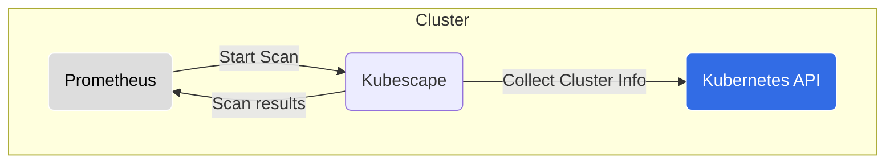

# Kubescape-Prometheus Integration

Most of the end-users either use [`prometheus-community/kube-prometheus-stack`](https://github.com/prometheus-community/helm-charts/tree/main/charts/kube-prometheus-stack) or [`prometheus-community/prometheus`](https://github.com/prometheus-community/helm-charts/tree/main/charts/prometheus) to install Prometheus for monitoring. Based on your choice of Prometheus, you can follow either of the below methods to enable kubescape monitoring with Prometheus.

---

## Prometheus operator (kube-prometheus-stack) helm chart

1. Install the `kube-prometheus-stack` Helm Chart
```
helm repo add prometheus-community https://prometheus-community.github.io/helm-charts
helm repo update
kubectl create namespace prometheus
helm install -n prometheus kube-prometheus-stack prometheus-community/kube-prometheus-stack --set prometheus.prometheusSpec.podMonitorSelectorNilUsesHelmValues=false,prometheus.prometheusSpec.serviceMonitorSelectorNilUsesHelmValues=false
```

2. Install the `kubescape-operator` Helm Chart with `capabilities.prometheusExporter` enabled

```
helm repo add kubescape https://kubescape.github.io/helm-charts/
helm repo update
helm upgrade --install <...> --set capabilities.prometheusExporter=enable
``` 

---

## Prometheus community helm chart

1. Install the `prometheus-community` Helm Chart
```
helm repo add prometheus-community https://prometheus-community.github.io/helm-charts
helm repo update
kubectl create namespace prometheus
helm install -n prometheus prometheus prometheus-community/prometheus
```

2. Install the `kubescape-operator` Helm Chart with `capabilities.prometheusExporter` and `configurations.prometheusAnnotations` enabled

```
helm repo add kubescape https://kubescape.github.io/helm-charts/
helm repo update
helm upgrade --install <...> --set capabilities.prometheusExporter=enable --set configurations.prometheusAnnotations=enable
```

---

## Component Diagram

