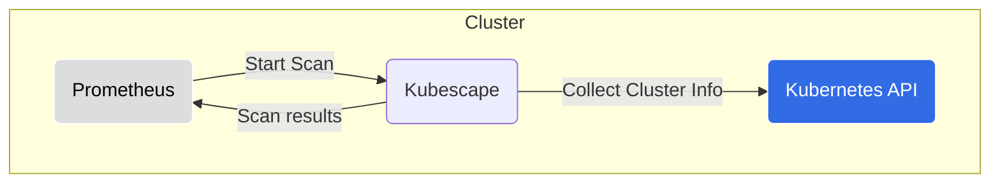

# Kubescape-Prometheus Integrations

Kubescape can be export two kinds of data to Prometheus:

- [Scan results](#scan-results)
- [Node agent metrics](#node-agent-metrics)

## Scan results

Most of the end-users either use [`prometheus-community/kube-prometheus-stack`](https://github.com/prometheus-community/helm-charts/tree/main/charts/kube-prometheus-stack) or [`prometheus-community/prometheus`](https://github.com/prometheus-community/helm-charts/tree/main/charts/prometheus) to install Prometheus for monitoring. Based on your choice of Prometheus, you can follow either of the below methods to enable kubescape monitoring with Prometheus.

### Prometheus operator (kube-prometheus-stack) helm chart

---

1. Install the `kube-prometheus-stack` Helm Chart
```
helm repo add prometheus-community https://prometheus-community.github.io/helm-charts
helm repo update
kubectl create namespace prometheus
helm install -n prometheus kube-prometheus-stack prometheus-community/kube-prometheus-stack --set prometheus.prometheusSpec.podMonitorSelectorNilUsesHelmValues=false,prometheus.prometheusSpec.serviceMonitorSelectorNilUsesHelmValues=false
```

2. Install the `kubescape-operator` Helm Chart with `capabilities.prometheusExporter` enabled

```
helm repo add kubescape https://kubescape.github.io/helm-charts/
helm repo update
helm upgrade --install <...> --set capabilities.prometheusExporter=enable
```

---

### Prometheus community helm chart

1. Install the `prometheus-community` Helm Chart
```
helm repo add prometheus-community https://prometheus-community.github.io/helm-charts
helm repo update
kubectl create namespace prometheus
helm install -n prometheus prometheus prometheus-community/prometheus
```

2. Install the `kubescape-operator` Helm Chart with `capabilities.prometheusExporter` and `configurations.prometheusAnnotations` enabled

```
helm repo add kubescape https://kubescape.github.io/helm-charts/
helm repo update
helm upgrade --install <...> --set capabilities.prometheusExporter=enable --set configurations.prometheusAnnotations=enable
```

---

### Component Diagram


```mermaid
graph TB

subgraph Cluster
    pr(Prometheus)
    ks(Kubescape)
    k8sApi(Kubernetes API)
end

pr -->|Start Scan| ks
ks -->|Collect Cluster Info|k8sApi
ks -->|Scan results| pr

classDef k8s fill:#326ce5,stroke:#fff,stroke-width:1px,color:#fff;
classDef plain fill:#ddd,stroke:#fff,stroke-width:1px,color:#000

class k8sApi k8s
class pr plain
```
---

## Node agent metrics

### Prometheus Integration

#### Quick Setup

Kubescape Node-agent exposes metrics on port `:8080/metrics` for Prometheus scraping. This enables you to monitor runtime threat detection performance and collect security metrics in your existing monitoring stack.

To enable Prometheus integration with Kubescape, use the following Helm configuration:

```bash
helm upgrade --install kubescape kubescape/kubescape-operator \
  --namespace kubescape \
  --create-namespace \
  --set capabilities.runtimeDetection=enable \
  --set nodeAgent.config.prometheusExporter=enable \
  --set nodeAgent.serviceMonitor.enabled=true \
  --set configurations.prometheusAnnotations=enable
```

#### Configuration Options

| Parameter | Description | Default |
|-----------|-------------|---------|
| `nodeAgent.config.prometheusExporter` | Enables the `/metrics` endpoint on port 8080 | `disable` |
| `nodeAgent.serviceMonitor.enabled` | Creates a ServiceMonitor for Prometheus Operator | `false` |
| `configurations.prometheusAnnotations` | Adds Prometheus scraping annotations to Pods | `disable` |


Once enabled, the following metrics will be available at `http://node-agent-pod:8080/metrics`:

- Runtime detection alerts: Count of security alerts by severity and rule type
- eBPF program status: Health and performance of kernel-level monitoring
- eBPF event counters: Count of events received by the eBPF probe

#### Service Discovery

If you're using Prometheus Operator, the ServiceMonitor will automatically configure scraping (no need to add anything to your `prometheus.yml`). For standalone Prometheus, add the following to your `prometheus.yml`:

```yaml
scrape_configs:
  - job_name: 'kubescape-node-agent'
    kubernetes_sd_configs:
      - role: pod
    relabel_configs:
      - source_labels: [__meta_kubernetes_pod_label_app_kubernetes_io_name]
        regex: kubescape-node-agent
        action: keep
      - source_labels: [__meta_kubernetes_pod_container_port_number]
        regex: "8080"
        action: keep
    metrics_path: /metrics
```

### Metrics
Kubescape Node-agent exports a rich set of metrics to Prometheus:

#### eBPF Event Counters
* `node_agent_exec_counter` : Total number of exec events received from the eBPF probe
* `node_agent_open_counter` : Total number of open events received from the eBPF probe
* `node_agent_network_counter` : Total number of network events received from the eBPF probe
* `node_agent_dns_counter` : Total number of DNS events received from the eBPF probe
* `node_agent_syscall_counter` : Total number of syscall events received from the eBPF probe
* `node_agent_capability_counter` : Total number of capability events received from the eBPF probe
* `node_agent_randomx_counter` : Total number of randomx events received from the eBPF probe
* `node_agent_ebpf_event_failure_counter` : Total number of failed events received from the eBPF probe
* `node_agent_symlink_counter` : Total number of symlink events received from the eBPF probe
* `node_agent_hardlink_counter` : Total number of hardlink events received from the eBPF probe
* `node_agent_ssh_counter` : Total number of SSH events received from the eBPF probe
* `node_agent_http_counter` : Total number of HTTP events received from the eBPF probe
* `node_agent_ptrace_counter` : Total number of ptrace events received from the eBPF probe
* `node_agent_iouring_counter` : Total number of io_uring events received from the eBPF probe

#### Rule Engine Metrics
* `node_agent_rule_counter` : Total number of rules processed by the engine (labeled by rule_id)
* `node_agent_alert_counter` : Total number of alerts sent by the engine (labeled by rule_id)

#### eBPF Program Performance Metrics
* `node_agent_program_current_runtime` : Current runtime of programs by program ID (labeled by program_type, program_name)
* `node_agent_program_current_run_count` : Current run count of programs by program ID (labeled by program_type, program_name)
* `node_agent_program_total_runtime` : Total runtime of programs by program ID (labeled by program_type, program_name)
* `node_agent_program_total_run_count` : Total run count of programs by program ID (labeled by program_type, program_name)
* `node_agent_program_map_memory` : Map memory usage of programs by program ID (labeled by program_type, program_name)
* `node_agent_program_map_count` : Map count of programs by program ID (labeled by program_type, program_name)
* `node_agent_program_total_cpu_usage` : Total CPU usage of programs by program ID (labeled by program_type, program_name)
* `node_agent_program_per_cpu_usage` : Per-CPU usage of programs by program ID (labeled by program_type, program_name)

#### Container Lifecycle Metrics
* `node_agent_container_start_counter` : Total number of container start events
* `node_agent_container_stop_counter` : Total number of container stop events


