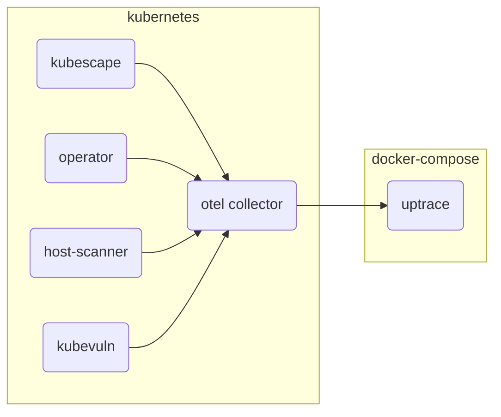

# Setting up Telemetry

Several of Kubescape's in-cluster components implement telemetry data using [OpenTelemetry](https://opentelemetry.io/) (otel).\
You can optionally install an Otel [collector](https://opentelemetry.io/docs/collector/) to your cluster to aggregate all metrics and send them to your own tracing tool.

You simply have to fill in this information before [installing kubescape operator](/../install-operator.md):\
you need to edit the property below at [values.yaml](https://github.com/kubescape/helm-charts/blob/main/charts/kubescape-operator/values.yaml) OR using --set while installing the helm chart\

```
configurations:
  otelUrl: # default is empty ,add yours otel URL here 
```

If you don't have an otel distribution, we suggest you try either [Uptrace](https://github.com/uptrace/uptrace/tree/master/example/docker) or [SigNoz](https://signoz.io/docs/install/docker/)
as they are free, opensource and can be quickly deployed using docker-compose.

## Host metrics collection

The OpenTelemetry collector is configured with the [`hostmetrics`](https://github.com/open-telemetry/opentelemetry-collector-contrib/blob/main/receiver/hostmetricsreceiver/README.md) receiver to collect CPU and memory utilization metrics.

Note that the hostmetrics receiver is disabled by default. If you wish to enable it, simply install the operator with `--set otelCollector.hostmetrics.enabled=true`

#### Example: exporting to uptrace running inside docker-compose



1. Download the example using Git:

```shell
git clone https://github.com/uptrace/uptrace.git
cd uptrace/example/docker
```

2. Start the services using Docker:

```shell
docker-compose pull
docker-compose up -d
```

3. Make sure Uptrace is running:

```shell
docker-compose logs uptrace
```

4. Follow the [instructions above](#installing-kubescape-operator-in-a-kubernetes-cluster-using-helm), add the OTEL collector configuration and install the operator as follows:
  
  ```
  --set configurations.otelUrl=<collector host>:14317 --set otelCollector.endpoint.insecure=false
  ```

5. Open Uptrace UI at [http://localhost:14318/overview/2](http://localhost:14318/overview/2)

