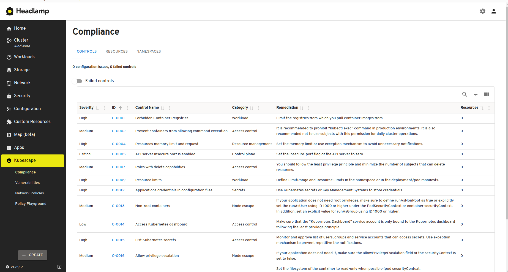
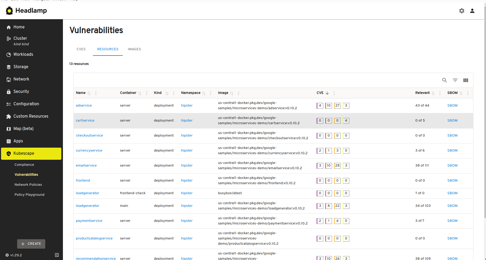
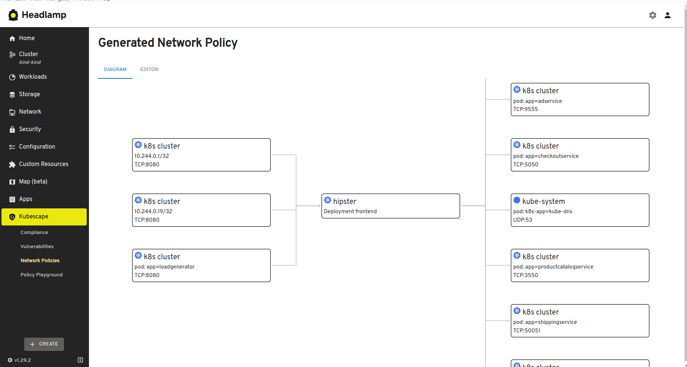

# Setting up a UI with Headlamp

When using Kubescape Operator, you can also access the information Kubescape produces using [Headlamp](https://headlamp.dev/) that gives a nice graphical interface.

The [Kubescape Headlamp plug-in](https://headlamp.dev/) was built by [Matthijs](https://github.com/mgalesloot)!

## Kubescape Operator installation

Follow the [standard Operator installation procedure](../install-operator.md) and make sure you enable continuousScan `--set capabilities.continuousScan=enable` and network observability `--set capabilities.networkPolicyService=enable`.

## Headlamp plugin installation

Make sure you have installed Headlamp, you can get it [here](https://headlamp.dev/#download-platforms)

### Desktop Headlamp

- Make sure "Display only Official Plugins" is unchecked in the settings of the "@headlamp-k8s/plugin-catalog" (Settings/Plugins)
- Select the Kubescape Headlamp plugin from the plugin catalog and click the install button

### In-cluster Headlamp

Please refer to [this](https://github.com/kubebeam/kubescape-headlamp-plugin/blob/main/README.md#in-cluster-headlamp)

## Functionality

The plugin gives you access to
* Configuration/compliance scan results
* Vulnerability information on workloads (multiple views)
* Network policy proposals and relational graph
* CEL admission policy playground

## Screenshots

### Compliance and configuration scaning

### Vulnerability scaning

### Network policy

